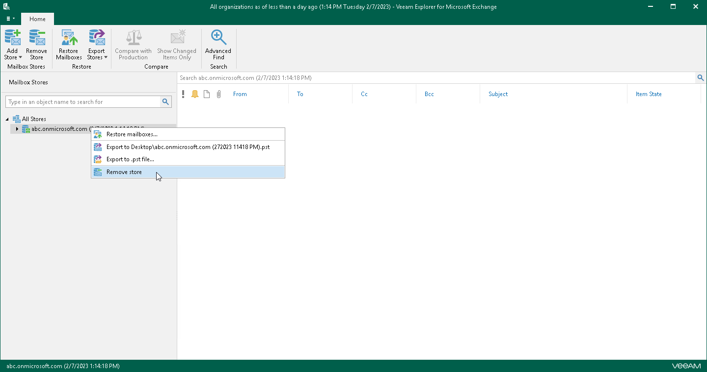

# Removing Stores

Veeam Explorer for Microsoft Exchange allows you to remove an Exchange store from the application scope when you no longer need it.

To remove a store from the application scope, right-click a store in the navigation pane and select Remove store.

