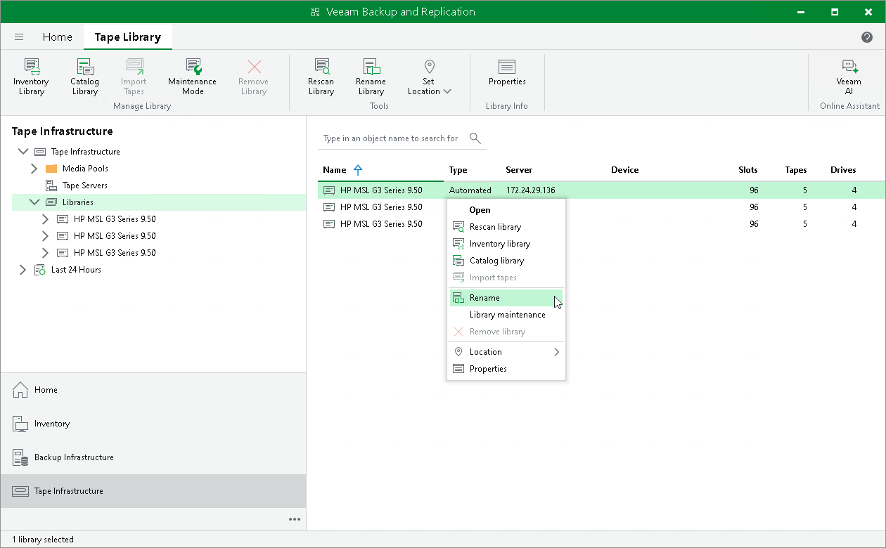

# Renaming Tape Devices

The Veeam backup console shows all tape libraries and standalone tape drives under the list of libraries. By default, the connected devices are shown with their production model names. For clearer visibility, you can rename them.

To rename a tape device:

1. Open the Tape Infrastructure view.
2. Select the Libraries node in the inventory pane.
3. Select a necessary item in the working area and click Rename Library on the ribbon. You can also right-click the necessary device in the working area and select Rename.

