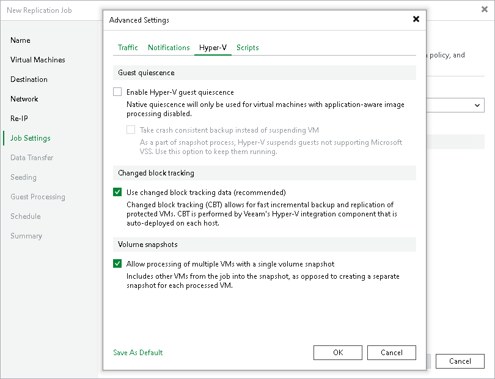

# Hyper-V Settings

To specify Hyper-V settings for the replication job:

1. At the Job Settings step of the wizard, click Customize advanced job settings.
2. In the Advanced Settings window, click the Hyper-V tab.
3. In the Guest quiescence section, do the following:

1. If VMs added to the replication job do not support Microsoft VSS framework or you want to use native Microsoft Hyper-V method for guest quiescence, select the Enable Hyper-V guest quiescence check box.

Veeam Backup & Replication will use the online backup method. For more information on the method, its requirements and limitations, see [Online Backup](online_backup.md).

|  |
| --- |
| Note |
| We recommend you to enable also [application-aware processing](replica_vss_application_hv.md). If it is enabled for the job, Veeam Backup & Replication first attempts to use the application-aware processing to prepare VMs for replication. If Veeam Backup & Replication manages to quiesce all VMs in the job with application-aware processing, it does not use Microsoft Hyper-V guest quiescence. If some VMs cannot be quiesced with application-aware processing, Veeam Backup & Replication uses Microsoft Hyper-V guest quiescence. |

1. If you do not want to suspend VMs, select the Take crash consistent backup instead of suspending VM check box. In this case, Veeam Backup & Replication will create crash-consistent VM replicas.

1. In the Changed block tracking section, specify if you want to use changed block tracking (CBT) for VM replication. For more information on CBT, see [Changed Block Tracking](changed_block_tracking_hv.md).
2. If you have added several VMs to the job, select the Allow processing of multiple VMs with a single volume snapshot check box. This option helps reduce snapshot workload in the Microsoft Hyper-V environment. When the job starts, Veeam Backup & Replication will group VMs and trigger Microsoft Hyper-V to create one volume snapshot for a group of VMs, instead of creating a volume snapshot per each processed VM.

Veeam Backup & Replication can create a single volume snapshot for a group of VMs that meet the following requirements:

+ VMs must be located on the same host.
+ Volumes on which VM files reside must use the same VSS provider for snapshot creation.
+ The number of VMs in the group is limited: for VSS software provider — 4 VMs, for VSS hardware provider — 8 VMs.
+ Veeam Backup & Replication groups VMs based on the method of snapshot creation that is used for replication: transactionally consistent (VSS) or crash-consistent.

For example, you add to the job two VMs that are registered on the same host. VM1 resides on volume C:\ and VM2 resides on volume D:\. Both VMs use Microsoft Software Shadow Copy Provider. In this situation, Veeam Backup & Replication will create a single snapshot for these VMs.

1. If you want to save this set of settings as the default one, click Save as default. When you create a new job, the saved settings will be offered as the default. This also applies to all users added to the backup server.

|  |
| --- |
| Note |
| The Allow processing of multiple VMs with a single volume snapshot option is not applicable to VMs registered on Microsoft Hyper-V Server 2016 and later that are processed in the onhost backup mode. |

