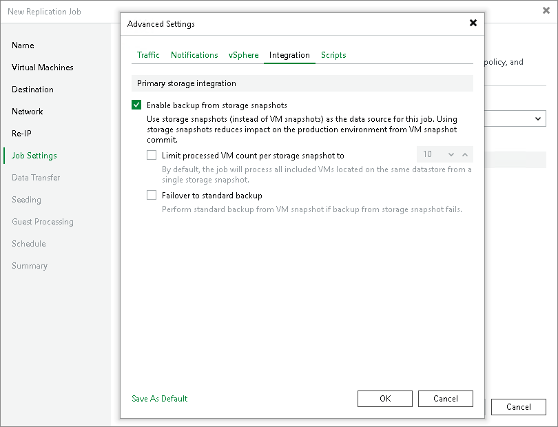

# Integration Settings

In this article

On the Integration tab, define whether you want to use the Backup from Storage Snapshots technology to create a VM replica. Backup from Storage Snapshots lets you leverage storage snapshots for VM data processing. The technology improves RPOs and reduces the impact of replication activities on the production environment. For more information, see the [Backup from Storage Snapshot](backup_from_storage_snapshots.md) section.

To specify storage integration settings for the replication job:

1. Check prerequisites. For more information, see the [Configuring Backup from Storage Snapshots](storage_backup.md) section.
2. At the Job Settings step of the wizard, click Advanced.
3. Click the Integration tab.
4. By default, Backup from Storage Snapshots functionality is enabled. If you do not want to use it, clear the Enable backup from storage snapshots check box.
5. If you add to the job many VMs whose disks are located on the same volume or LUN, select the Limit processed VM count per storage snapshot to check box and specify the number of VMs for which one storage snapshot must be created.

In a regular job processing course, Veeam Backup & Replication creates a VMware snapshot for every VM added to the job and then triggers one storage snapshot for all VMs. In some situations, creating VMware snapshots for all VMs may require a lot of time. If you limit the number of VMs per storage snapshot, Veeam Backup & Replication will divide VMs into several groups, trigger a separate storage snapshot for every VM group and read VM data from these snapshots. As a result, the job performance will increase. For more information, see the [Limitation on Number of VMs per Snapshot](storage_limiting.md) section.

1. If Veeam Backup & Replication fails to create a storage snapshot, VMs whose disks are hosted on the storage system will not be processed by the job. To fail over to the regular data processing mode and replicate such VMs, select the Failover to standard backup check box.

Page updated 4/16/2025

Page content applies to build 13.0.1.1071
