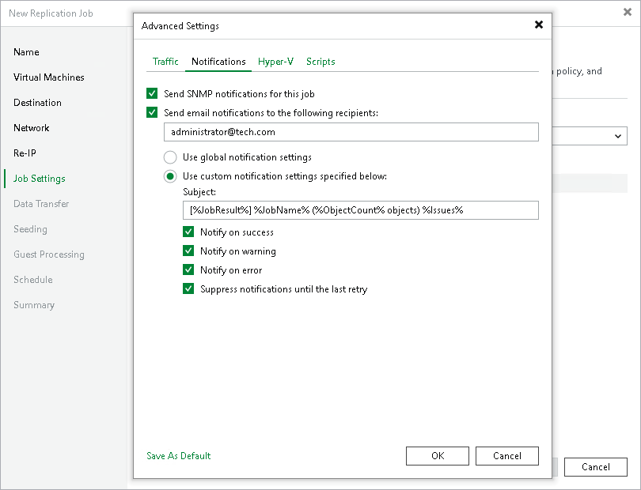

# Notification Settings

To specify notification settings for the replication job:

1. At the Job Settings step of the wizard, click Advanced settings.
2. In the Advanced Settings window, click the Notifications tab.
3. To receive SNMP traps when the job completes successfully, select the Send SNMP notifications for this job check box.

SNMP traps will be sent if you configure global SNMP settings in Veeam Backup & Replication and configure software on recipient machine to receive SNMP traps. For more information, see [Specifying SNMP Settings](snmp_settings.md).

1. To receive notifications by email in case of job failure, success or warning, select the Send email notifications to the following recipients check box. Then configure notification settings:

1. Check that you have configured global email notification settings as described in section [Configuring Global Email Notification Settings](general_email_notifications.md).
2. In the text field, specify a recipient email address. If you want to specify multiple addresses, separate them by a semicolon.
3. To use global notification settings, select Use global notification settings.
4. To specify a custom notification subject and redefine at which time notifications must be sent, select Use custom notification settings specified below. Then specify the following settings:

1. In the Subject field, specify a notification subject. You can use the following variables in the subject: %JobResult%, %JobName%, %ObjectCount% (number of VMs in the job) and %Issues% (number of VMs in the job that have been processed with the Warning or Failed status).
2. Select the Notify on success, Notify on error or Notify on warning check boxes to receive an email notification if the job gets the Warning, Success or Error status.
3. Select the Suppress notifications until the last retry check box to receive the notification about the final job status. If you do not enable this option, Veeam Backup & Replication will send one notification per every job retry.

1. If you want to save this set of settings as the default one, click Save as default. When you create a new job, the saved settings will be offered as the default. This also applies to all users added to the backup server.

