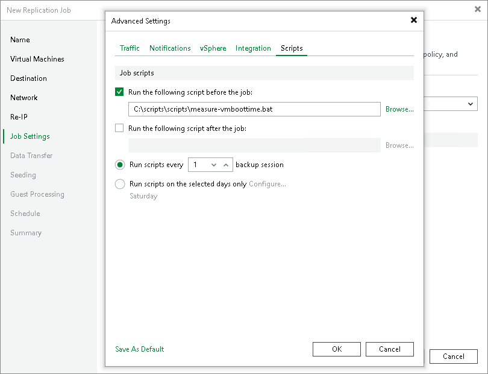

# Script Settings

To specify script settings for the replication job:

1. At the Job Settings step of the wizard, click Advanced settings.
2. In the Advanced Settings window, click the Scripts tab.
3. If you want to execute custom scripts before or after the replication job, select the Run the following script before the job or Run the following script after the job check boxes. Click Browse to choose executable files from a local folder on the backup server. The scripts will be executed on the backup server.
4. Configure when to execute pre- and post-replication scripts:

* To execute scripts after a number of job sessions, select the Run scripts every... backup session option and then specify the number of the replication job sessions.
* To execute scripts on specific week days, select the Run scripts on selected days only option. Click Days and specify week days on which scripts must be executed.

1. If you want to save this set of settings as the default one, click Save as default. When you create a new job, the saved settings will be offered as the default. This also applies to all users added to the backup server.

|  |
| --- |
| Note |
| Consider the following:   * Custom scripts that you define in the advanced job settings relate to the job itself, not the VM quiescence process. To add pre-freeze and post-thaw scripts for VM image quiescence, use the Guest Processing step of the wizard.  * If you select the Run scripts on the selected days only option, Veeam Backup & Replication executes scripts only once on each selected day — when the job runs for the first time. During subsequent job runs, scripts are not executed.  * To run the script, Veeam Backup & Replication uses the service account under which the Veeam Backup Service is running. |

