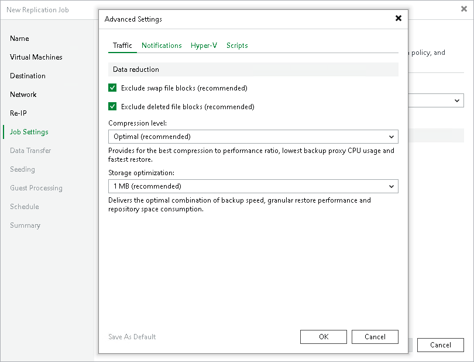

# Traffic Settings

In this article

You can optimize data traffic sent over network by specifying which data you want to replicate, data compression level and optimize the job performance and storage usage:

1. At the Job Settings step of the wizard, click Customize advanced job settings.
2. In the Advanced Settings window, check that the Traffic tab is selected.
3. [For Microsoft Windows NTFS] By default, Veeam Backup & Replication excludes data blocks of the hiberfil.sys and pagefile.sys system files from replicas. For more information on how Veeam Backup & Replication excludes data blocks of these system files, see [Swap Files](swap_files_hv.md).

If you want to include data blocks of the hiberfil.sys and pagefile.sys system files into replicas, clear the Exclude swap file blocks check box. Note that including these files into replicas will increase their size.

1. By default, Veeam Backup & Replication does not copy deleted file blocks ("dirty" blocks on the VM guest OS) to the target location. For more information, see [Deleted File Blocks](dirty_blocks_hv.md).

If you want to include dirty data blocks into VM replicas, clear the Exclude deleted file blocks check box. Note that including these files into replicas will increase their size.

1. From the Compression level list, select a compression level for VM replicas. For more information on data compression and compressions levels, see [Data Compression](compression_deduplication_hv.md).
2. In the Storage optimization section, select block size that will be used to process VMs. For more information on the data blocks sizes and how they affect performance, see [Storage Optimization](compression_deduplication_hv.md).
3. If you want to save this set of settings as the default one, click Save as default. When you create a new job, the saved settings will be offered as the default. This also applies to all users added to the backup server.

Page updated 7/24/2025

Page content applies to build 13.0.1.1071
