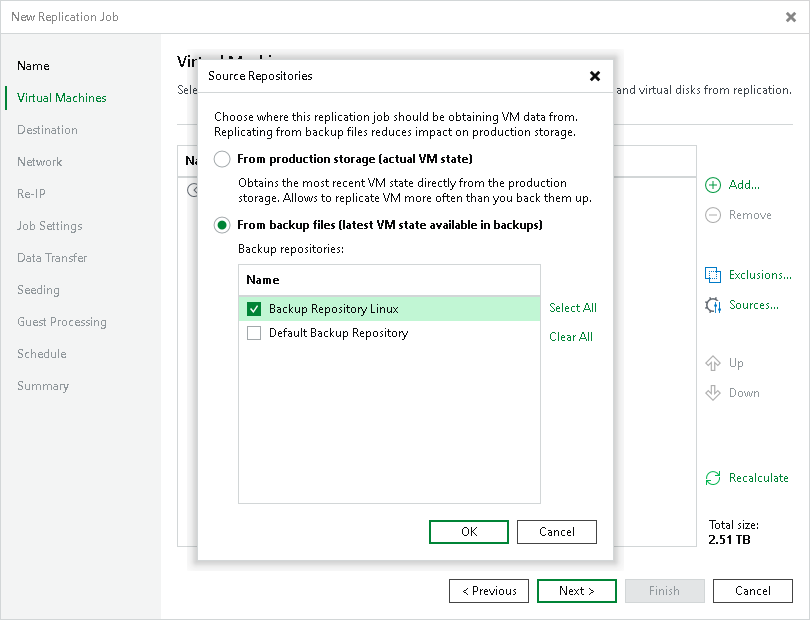

# Step 4. Specify Data Source

You can enable replication from production storage. For this, select a data source from which Veeam Backup & Replication will read VM data:

1. At the Virtual Machines step of the wizard, click Sources.
2. In the Source Repositories window, select one of the following options:

* From production storage. In this case, Veeam Backup & Replication will retrieve VM data from datastores connected to the source host.
* From backup files. In this case, Veeam Backup & Replication will read VM data from the backup chain already existing in the selected backup repository. This option can be used in the replica from backup scenario.

Related Topics

[Replica from Backup](replica_from_backup.md)

