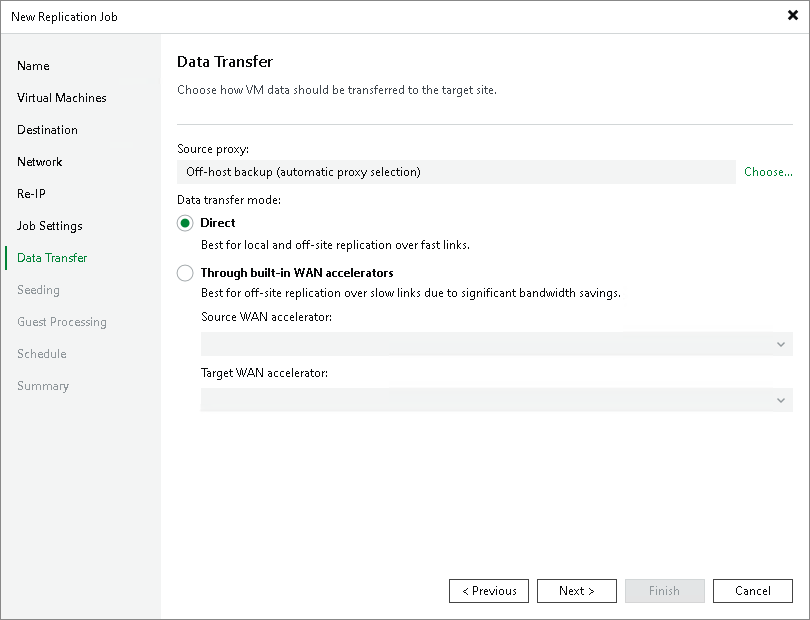

# Step 12. Specify Data Transfer Settings

In this article

At the Data Transfer step of the wizard, select backup infrastructure components that must be used for the replication process and choose a path for VM data transfer:

1. Specify which backup proxies you want to use:

* If you want Veeam Backup & Replication to use off-host backup proxies for the replication, leave the Off-host backup mode selected. In this mode, all data processing operations are moved to the off-host backup proxy from the source host.

By default, Veeam Backup & Replication selects the off-host backup proxies automatically. Veeam Backup & Replication analyzes the current load on off-host backup proxies and proxy settings (such as the number of allowed tasks, connectivity to the source volumes) and selects the most appropriate proxy. You can explicitly select which off-host backup proxies the job must use. To do this, click Choose. In the Backup Proxy window, select the Use the following backup proxy servers only check box and choose one or multiple off-host backup proxies from the list. We recommend you select at least two off-host backup proxies to ensure that the replication job starts if one of the proxies fails or loses its connectivity to the source volumes.

By default, if there are no off-host backup proxies available when the job starts, Veeam Backup & Replication automatically fails over to the on-host backup mode. To disable failover, in the Backup Proxy window, clear the Failover to on-host backup mode if no suitable off-host proxies available check box. If you disable this option, you must check off-host backup proxies in the backup infrastructure before the job starts. The job will not be able to start if off-host backup proxies are not available or not configured properly.

* If you want to use the Microsoft Hyper-V host as the source host and backup proxy, click Choose and select On-host backup in the Backup Proxy window. In this mode, all data processing operation are performed directly on the source host, which helps streamline data retrieval operations but puts additional load on the host.

If the job processes a VM whose disks are located on the CSV and Microsoft CSV Software Shadow Copy Provider is used for snapshot creation, the Microsoft Hyper-V host that owns the CSV will be used as the on-host backup proxy.

1. Select a path for VM data transfer:

* If you replicate data over the LAN or fast connections, select Direct. In this case, Veeam Backup & Replication transfers data directly from the on-host/off-host backup proxy to the target volume.
* If you have a weak WAN link, select Through built-in WAN accelerators. In this case, Veeam Backup & Replication transfers data using the selected WAN accelerators. From the Source WAN accelerator list, select the WAN accelerator configured in the source site. From the Target WAN accelerator list, select the WAN accelerator configured in the target site.

For more information on where backup infrastructure components must be placed, see [Replication Scenarios](replication_scenarios_hv.md).

|  |
| --- |
| Note |
| You should not assign one source WAN accelerator to several replication jobs that you plan to run simultaneously. The source WAN accelerator requires a lot of CPU and RAM resources, and does not process multiple replication tasks in parallel. As an alternative, you can create one replication job for all VMs you plan to process over one source WAN accelerator.  The target WAN accelerator, however, can be assigned to several replication jobs. For more information, see [Adding WAN Accelerators](wan_add.md). |

Page updated 1/29/2025

Page content applies to build 13.0.1.1071
