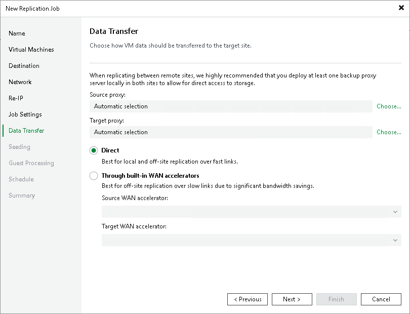

# Step 12. Specify Data Transfer Settings

In this article

At the Data Transfer step of the wizard, select backup infrastructure components that must be used for the replication process and choose a path for VM data transfer:

1. Specify which backup proxies you want to use:

* If you want Veeam Backup & Replication to select proxies automatically, leave Automatic selection in the Source proxy and Target proxy fields.

Veeam Backup & Replication will assign backup proxies for VM processing one by one. Before processing a new VM from the list, Veeam Backup & Replication will check available backup proxies. If more than one backup proxy is available, Veeam Backup & Replication analyzes transport modes that the backup proxies can use and the current workload on the backup proxies to select the most appropriate backup proxy for VM processing.

* If you want to select backup proxies manually, do the following:

1. Click Choose next to the Source proxy field if you want to select backup proxies in the production site, or next to the Target proxy field if you want to select backup proxies in the disaster recovery site.
2. In the Backup Proxy window, click Use the selected backup proxy servers only. Select proxies that you want to use and click OK.

|  |
| --- |
| Note |
| Consider the following:   * The Source proxy field is not available for the replication from backup scenario. * If you plan to replicate VM data within one site, the same backup proxy can act as the source and target backup proxy. For off-site replication, you must deploy at least one backup proxy in each site to establish a stable connection for VM data transfer across sites. * We recommend you to select at least two backup proxies to ensure that the job will be performed if one of backup proxies fails or loses its connectivity to the source datastore. |

1. Select a path for VM data transfer:

* To transport VM data directly using backup proxies to the target datastore, select Direct.
* To transport VM data using WAN accelerators, select Through built-in WAN accelerators. From the Source WAN accelerator list, select the WAN accelerator configured in the source site. From the Target WAN accelerator list, select the WAN accelerator configured in the target site.

|  |
| --- |
| Note |
| You should not assign one source WAN accelerator to several replication jobs that you plan to run simultaneously. The source WAN accelerator requires a lot of CPU and RAM resources, and does not process multiple replication tasks in parallel. As an alternative, you can create one replication job for all VMs you plan to process over one source WAN accelerator.  The target WAN accelerator, however, can be assigned to several replication jobs. For more information, see [Adding WAN Accelerators](wan_add.md). |

Page updated 10/31/2025

Page content applies to build 13.0.1.1071
