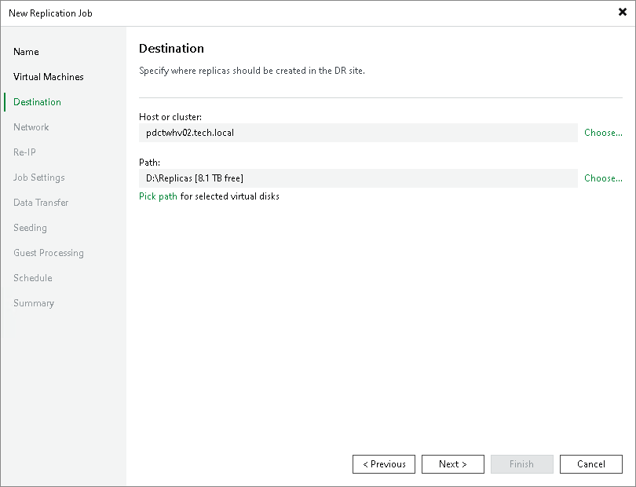

# Step 7. Specify Replica Destination

At the Destination step of the wizard, select a destination for replicas:

1. Next to the Host or cluster field, click Choose and select a host or cluster where replicas must be registered. If you select a cluster as a target, the replication process will become more sustainable — the replication process will not fail if there is at least one available host in the cluster.
2. Next to the Path field, click Choose and specify a path to the folder where VM replica files must be stored. By default, Veeam Backup & Replication stores VM replica files to the C:\Replicas folder (if you have selected a Microsoft Hyper-V host as a target) or on a CSV with the maximum amount of free space (if you have selected a Microsoft Hyper-V cluster as a target).

You can specify the following folders:

1. An existing folder on a host.
2. A new folder on a host. To do this, in the Select Folder window, select a location where the folder must be created. Click New Folder and specify a folder name.
3. [For Microsoft Windows-based backup server] A Microsoft SMB3 shared folder. To do this, in the search field at the bottom of the Select Folder window, enter a path to the Microsoft SMB3 shared folder. The path must be specified in the UNC format, for example: \\172.16.11.38\Share01.

The host or cluster you specify in the Host or cluster field must have access to the Microsoft SMB3 shared folder. If you are using Microsoft SCVMM 2012 or Microsoft SCVMM 2012 R2, the server hosting the Microsoft SMB3 share must be registered in Microsoft SCVMM as a storage device. For more information, see [Microsoft Docs](http://technet.microsoft.com/en-us/library/jj614620.aspx).

If you have selected to replicate multiple VMs and want to place individual replicas to other folders:

1. Click the Pick VM folder for selected replicas link.
2. In the Choose VM Files Location window, click Add.
3. In the Add Objects window, select the necessary VMs and click Add.
4. In the Choose VM Files Location window, select the necessary VMs in the Files Location list. At the bottom of the window, click Path.
5. In the Select Folder window, select the necessary folder or create a new one. Click OK.
6. In the Choose VM Files Location window, click OK.

1. If you want to store replica configuration files and disk files in different locations:

1. Click the Pick path for selected virtual disks link.
2. In the Choose VM Files Location window, click Add.
3. In the Add Objects window, select the necessary VMs and click Add.
4. In the Choose VM Files Location window, expand the necessary VMs in the Files location list, and select the necessary files. At the bottom of the window, click Path.
5. In the Select Folder window, select the destination for the selected type of files. Click OK.
6. In the Choose VM Files Location window, click OK.

|  |
| --- |
| Note |
| Consider the following:   * After a replication job finishes, you can change the target location for replica files. However, the target will be changed only for newly added files — new replica files if you change the path and new VMs if you change the host. The target for "old" files will not be changed.   To change the location for "old" files, disable the replication job, change the target location and [remove the replicas from the configuration](remove_replica_from_configuration_hv.md). Then migrate the replicas to the specified location, register the migrated VMs and [map](replica_seeding_hv.md) the replication job to these VMs. Alternatively, you can remove replicas and start the job. The replica files will be created anew.   * Disks added to the source VM after the job has already run are replicated to a <GUID> subfolder in the selected destination. This helps avoid confusion with identically named disks of other machines. If you want to place new disks to the selected destination without the subfolder, specify the disk destination explicitly using the Pick path for selected virtual disks option. |

