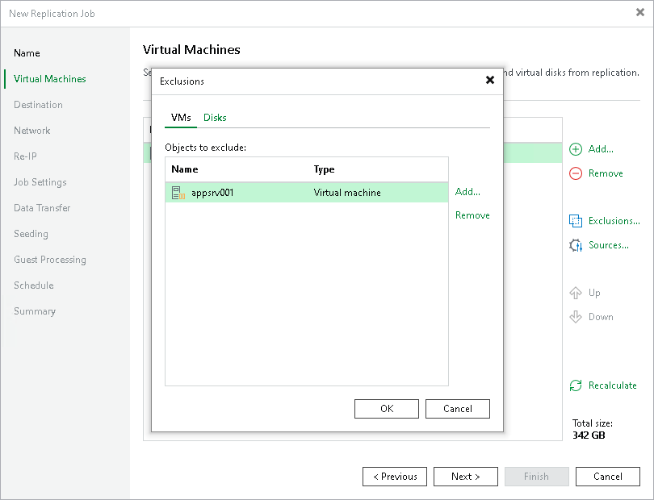
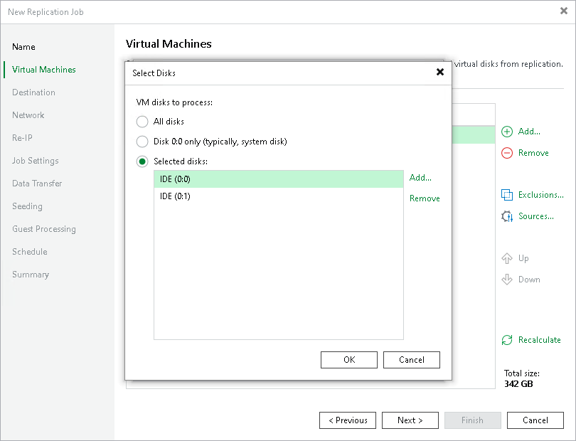

# Step 5. Exclude Objects from Replication Job

After you have added VMs and VM containers to the replication job, you can specify which objects you want to exclude from replicas. You can exclude the following types of objects:

* [VMs or VM containers](#vm)
* [VM disks](#disk)

Excluding VMs or VM Containers

To exclude VMs from a VM container:

1. At the Virtual Machines step of the wizard, click Exclusions.
2. In the Exclusions window, check that the VMs tab is selected and click Add.
3. In the Add Objects window, select VMs or VM containers that you want to exclude from being replicated and click Add.
4. Click OK.

Excluding Disks

To exclude VM disks:

1. At the Virtual Machines step of the wizard, click Exclusions.
2. In the Exclusions window, do the following:

1. Switch to the Disks tab.
2. If you want to exclude disks of VMs that are added as a part of containers, click Add. In the Add Objects window, select the necessary VMs and click Add. Veeam Backup & Replication will include these VMs in the list as standalone objects.
3. In the Disks to process list, select VMs or VM containers whose disks you want to exclude.
4. Click Edit.

1. In the Select Disks window, select disks that you want to replicate: all disks, 0:0 disks (as a rule, system disks) or specific IDE or SCSI. Disks that you do not select will be excluded from processing. Click OK.
2. In the Exclusions window, click OK.

|  |
| --- |
| Note |
| If you exclude disks from being replicated and [enable application-aware processing](replica_vss_hv.md), Microsoft VSS framework will still process the disks and volumes on which the disks are located. |

