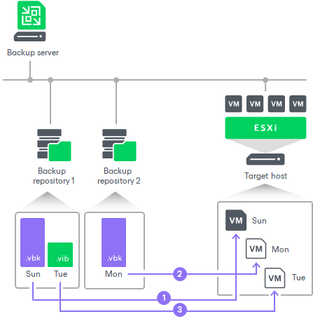

# How Replica from Backup Works

In this article

Replica from backup is performed along with a regular replication job. When you set up a replication job, you define a backup repository with VM backups as a source of data. If the backups for this VM are available in different backup repositories, you can [select several backup repositories as a source](replica_data_source_vm.md). In this case, Veeam Backup & Replication will look for the latest VM restore point across these backup repositories.

For example, you configure two backup jobs that process the same VM, and target these jobs at two different backup repositories. The backup jobs create the following backup files:

* Backup job 1 creates 2 restore points in Backup repository 1: full backup file on Sunday and incremental backup file on Tuesday.
* Backup Job 2 creates 1 restore point in Backup repository 2: full backup file on Monday.

The replication job is configured to retrieve VM data from backups and is scheduled to run daily. In this case, the replication job retrieves VM data from backups in the following way:

1. On Sunday, the replication job retrieves VM data from the full backup file in Backup repository 1.
2. On Monday, the replication job retrieves VM data from the full backup file in Backup repository 2.
3. On Tuesday, the replication job retrieves VM data from the incremental backup file in Backup repository 1.
4. Till next Sunday, the replication job does not retrieve any VM data because backup files are not created.

In some cases, a new restore point in the backup repository may not be created by the time a replication job starts. In this case, Veeam Backup & Replication displays a warning notifying that the latest restore point has already been replicated. The replication job session finishes with the Warning status.

In some cases, Veeam Backup & Replication can resume the replication process if data transfer was not finished, for example, because of the network disconnection. On the next run, Veeam Backup & Replication will continue data transfer for those disks for which Veeam Backup & Replication has started data processing and created snapshots during the current run.

|  |
| --- |
| Note |
| When you replicate a VM over a production network, Veeam Backup & Replication retrieves VM data as of the latest VM state. When you replicate a VM from backup, Veeam Backup & Replication retrieves VM data as of the point in time when the backup was created. The VM replica restore point has the same timestamp as a VM backup restore point, not the time when the replica job session is run. |

Page updated 1/22/2025

Page content applies to build 13.0.1.1071
