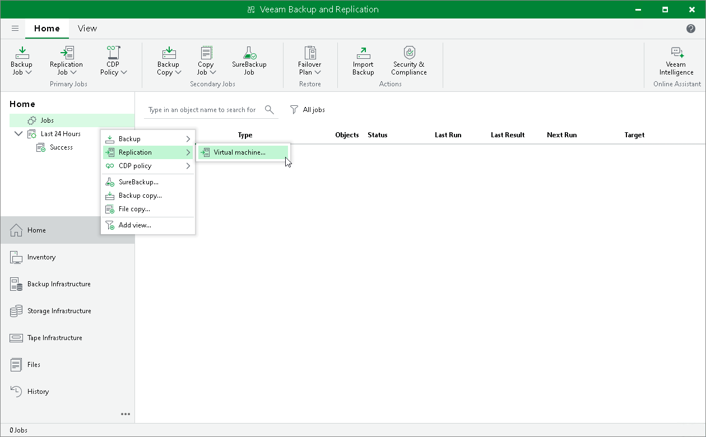

# Step 1. Launch New Replication Job Wizard

In this article

To launch the replication wizard, do one of the following:

* On the Home view. On the ribbon, click Replication Job > Virtual machine > <Platform>.
* Open the Home view. In the inventory pane right-click the Jobs node and select Replication > Virtual machine > <Platform>.

* Open the Inventory view. In the working area, select VMs that you want to replicate and right-click one of them. Select Add to replication job > New job if you want to create a new replication job, or Add to replication job > <Job Name> if you want to add VMs to an existing replication job.

Page updated 1/28/2025

Page content applies to build 13.0.1.1071
