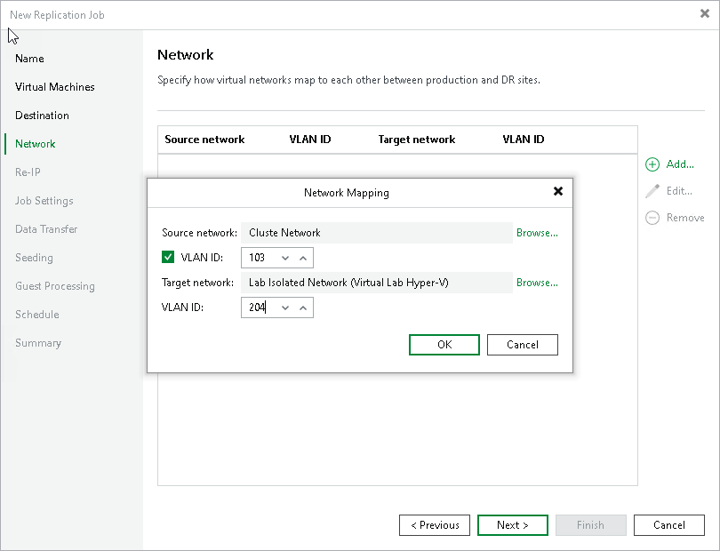

# Step 8. Create Network Mapping Table

The Network step of the wizard is available if you have selected the Network remapping option at the [Job](replica_name_hv.md) step of the wizard.

At the Network step of the wizard, configure a network mapping table. This table maps networks in the production site to networks in the disaster recovery (DR) site. When the job starts, Veeam Backup & Replication will check the network mapping table. Then Veeam Backup & Replication will update replica configuration files to replace the production networks with the specified networks in the DR site. As a result, you will not have to re-configure network settings manually.

To add a row to a network mapping table:

1. Click Add.
2. In the Network Mapping window, click Browse next to the Source network field.
3. In the Select Network window, select the production network to which the source VMs are connected and click OK.
4. In the Network Mapping window, click Browse next to the Target network field.
5. In the Select Network window, select a network in the DR site to which replicas will be connected and click OK.
6. If you use VLAN IDs for networking, select the VLAN ID check box and specify VLAN IDs of the source and target networks.

|  |
| --- |
| Note |
| For the source and target network, VLAN ID set to 0 refers to different values:   * For the source network, 0 refers to any VLAN including the disabled ones. * For the target network, 0 means VLAN is disabled. |

