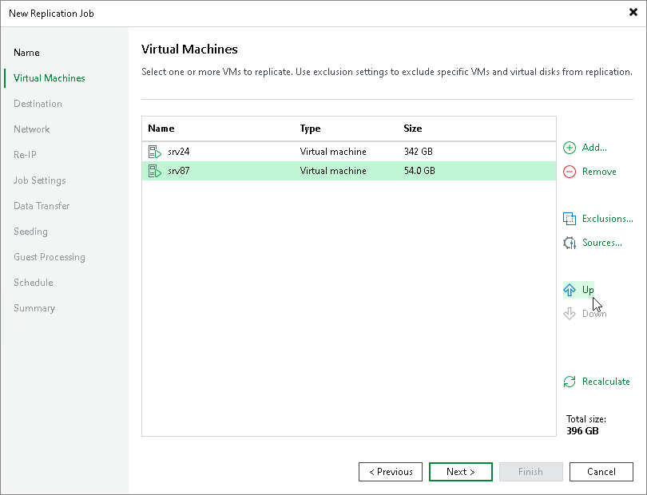

# Step 6. Specify VM Replication Order

At the Virtual Machines step of the wizard, click Up and Down to change the processing order. VMs at the top of the list have a higher priority and will be processed first.

Setting VM order can be helpful, for example, if you have added some mission-critical VMs to the job and want the job to process them first. You can set these VMs first in list to ensure that their processing fits the backup window.

|  |
| --- |
| Note |
| Consider the following:   * VMs inside a VM container are processed at random. To ensure that VMs are processed in the defined order, you must add them as standalone VMs, not as a part of containers. * The processing order may differ from the order that you have defined. For example, if resources of a VM that is higher in the priority are not available, and resources of a VM that is lower in the priority are available, Veeam Backup & Replication will process the VM with the lower priority first.   If you enable the Allow processing of multiple VMs with a single volume snapshot option in the [Advanced Replica Settings](replica_advanced_hv_hv.md), VMs may also be processed in a different order. This option unites VMs added to the job in several groups, and the defined VM order may be broken. |

