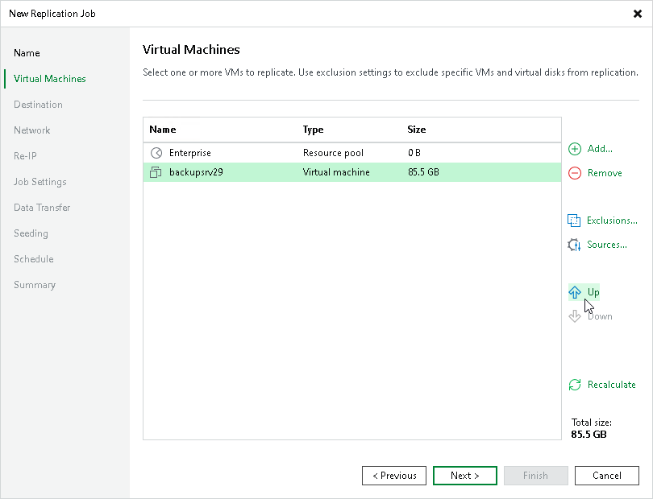

# Step 6. Specify VM Processing Order

In this article

At the Virtual Machines step of the wizard, click Up and Down to change the processing order. VMs at the top of the list have a higher priority and will be processed first.

|  |
| --- |
| Note |
| Consider the following:   * VMs inside a VM container are processed at random. To ensure that VMs are processed in the defined order, you must add them as standalone VMs, not as a part of containers. * The processing order may differ from the order that you have defined. For example, if resources of a VM that is higher in the priority are not available, and resources of a VM that is lower in the priority are available, Veeam Backup & Replication will process the VM with the lower priority first. |

Page updated 7/10/2025

Page content applies to build 13.0.1.1071
