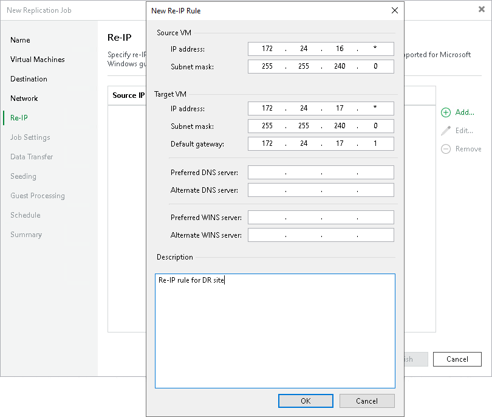

# Step 9. Configure Re-IP Rules

The Re-IP step of the wizard is available if you have selected the Replica re-IP option at the [Job](replica_name_hv.md) step of the wizard. This step applies only to VMs with Microsoft Windows OSes.

At the Re-IP step of the wizard, configure re-IP rules. These rules map IPs in the production site to IPs in the disaster recovery (DR) site. When you perform failover, Veeam Backup & Replication will check the configured re-IP rules and will change replica IPs if the rules apply. Replicas will get new IP addresses according to the network masks specified in the rules, so that you will be able to reach replicas in the DR site.

To configure a re-IP rule:

1. Click Add and select whether you want to configure an IPv4 or IPv6 rule. Note that you can use IPv6 addresses only if IPv6 communication is enabled as described in section [IPv6 Support](ipv6.md).
2. In the Source VM section, specify an IP numbering scheme used in the production site.

To facilitate the configuration, Veeam Backup & Replication detects an IP address and subnet mask for the backup server and pre-populates values in the Source VM section.

1. In the Target VM section, specify an IP address, subnet mask and default gateway that will be used for replicas in the DR site. If required, specify the DNS server addresses. For the IPv4 rules, you can also specify WINS server addresses.
2. In the Description field, provide a description.
3. Click OK.

|  |
| --- |
| Note |
| Consider the following:   * You can specify static IPs or IP ranges. Do not use 0 to specify IP address ranges. In Veeam Backup & Replication, value 172.16.17.0 means a regular IP address 172.16.17.0, not an IP address range. To specify a range, use the asterisk character (\*).  * Replica re-IP works only if you perform replica failover using Veeam Backup & Replication. If you power on a replica in some other way, for example, manually using a native client, re-IP rules will not be applied to it. * The backup server OS must support mounting of the system disks of VMs that will be replicated. |

