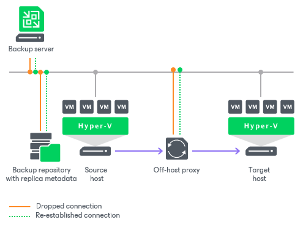

# Resume on Disconnect

In this article

Veeam Backup & Replication can handle a situation of an unstable network during backup, backup copy and replication jobs. If a network connection drops for a short period during the data transport process, Veeam Backup & Replication automatically resumes the dropped network connection. The data transfer process starts from the point when the connection was lost. The resume on disconnect capability improves the reliability of remote data transfer, reduces the backup window and minimizes the network load.

Veeam Backup & Replication automatically re-establishes a connection between the following backup infrastructure components engaged in the data transfer process:

* Backup server
* Source and target Microsoft Hyper-V hosts
* Off-host backup proxy
* Backup repository

Resume on disconnect works only for dropped network connections. Veeam Backup & Replication attempts to resume the connection at intervals of 15 seconds for 30 minutes. If the problem has any other nature, Veeam Backup & Replication retries the job in a regular manner.

Veeam Backup & Replication does not create a new restore point on resume: VM data is written to the same restore point that was created for the current job session. When resuming the data transfer process, Veeam Backup & Replication regards VM disks, not the whole VM.

For example, a VM has 2 disks: disk A and disk B. Before the connection dropped, Veeam Backup & Replication managed to transfer 20 GB of disk A and did not start transferring disk B. After the connection is re-established, Veeam Backup & Replication will start transferring the data for disk A from the 20 GB point; data of the whole disk B will be transferred anew.

Page updated 3/3/2025

Page content applies to build 13.0.1.1071
