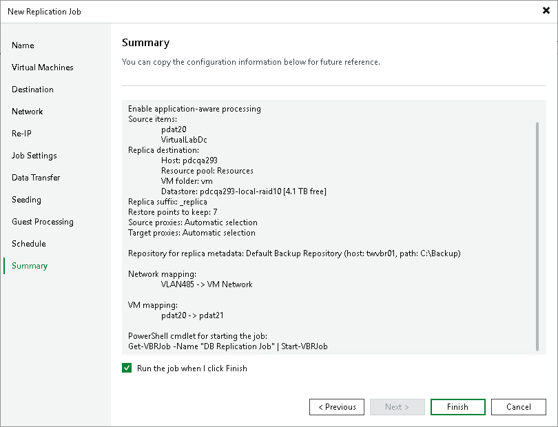

# Step 16. Finish Working with Wizard

At the Summary step of the wizard, review details of the replication job. If you want to start the job right after you close the wizard, select the Run the job when I click Finish check box, otherwise leave the check box unselected. Then click Finish to close the wizard.

