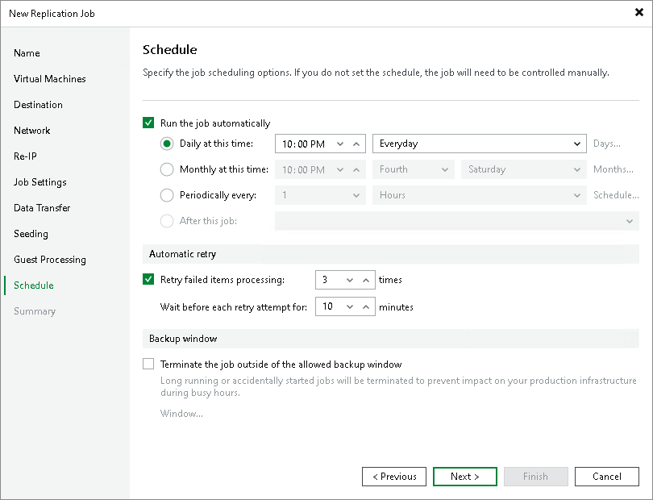

# Step 15. Define Job Schedule

At the Schedule step of the wizard, select to run the job manually or schedule the job to run on a regular basis:

1. To run the job automatically, select the Run the job automatically check box. If you do not select this check box, you will have to start the job manually.
2. Select the required schedule option:

+ Daily at this time. The job will run at a specific time daily, on weekdays or with specific periodicity. In the fields on the right of the radio button, specify the time and required days.
+ Monthly at this time. The job will run once a month on specific days. In the fields on the right of the radio button, specify the necessary days.
+ Periodically every. The job will run repeatedly throughout a day with a set time interval.

To configure the period and allowed hours, do the following:

1. In the field on the right of the radio button, select the necessary time unit. If you select Continuously, a new job session will start as soon as the previous job session finishes.
2. If you want to specify the permitted time window for the job, click Schedule. In the Time Periods window, specify the schedule.

If you want to shift the schedule, specify the offset in the Start time within an hour field. For example, you schedule the prohibited hours from 08:00 AM to 10:00 AM, and set the offset value to 25. The schedule will be shifted forward, and the prohibited hours will be from 8:00 AM and to 10:25 AM.

A repeatedly run job is started by the following rules:

+ Veeam Backup & Replication always starts counting defined intervals from 12:00 AM. For example, if you configure to run a job with a 4-hour interval, the job will start at 12:00 AM, 4:00 AM, 8:00 AM, 12:00 PM, 4:00 PM and so on.
+ If you define permitted hours for the job, after the denied interval is over, Veeam Backup & Replication will immediately start the job and then run the job by the defined schedule.

For example, you have configured a job to run with a 2-hour interval and defined permitted hours from 9:00 AM to 5:00 PM. According to the rules above, the job will first run at 9:00 AM, when the denied period is over. After that, the job will run at 10:00 AM, 12:00 PM, 2:00 PM and 4:00 PM.

+ After this job. The job will be chained. From the drop-down list, select a job after which the current job will run.

To create a chain of jobs, you must define the time schedule for the first job in the chain. For the rest of the jobs in the chain, at the Schedule step of the wizard, select the After this job option and choose the preceding job from the list. For more information on job chaining and recommendations for it, see Chained Jobs (link below).

|  |
| --- |
| Note |
| When you configure the job schedule, keep in mind possible date and time changes (for example, related to daylight saving time transition). |

1. In the Automatic retry section, select the Retry failed items processing if Veeam Backup & Replication must attempt to run the job again for workloads whose processing failed for some reason. Enter the number of attempts to run the job and define time spans between them.

If you select continuous schedule for the job, Veeam Backup & Replication will retry the job for the defined number of times without any time intervals between the job sessions.

1. In the Backup window section, specify a time interval within which the job must be completed. The backup window prevents the job from overlapping with production hours and ensures the job does not provide unwanted overhead on your production environment.

To set up a backup window for the job:

1. Select the Terminate the job outside of the allowed backup window check box and click Window.
2. In the Time Periods window, define the allowed hours and prohibited hours for the job. If the job exceeds the allowed window, the job will be automatically terminated.

Related Topics

[Chained Jobs](job_schedule_hv.md)

