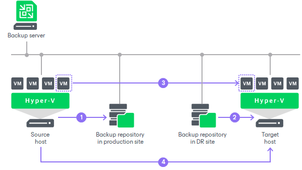
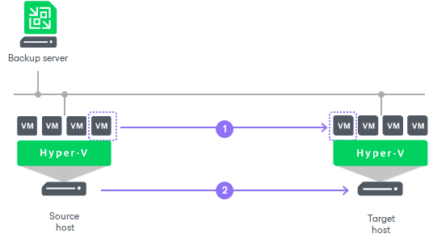

# Replica Seeding and Mapping

Replica seeding and mapping are technologies that help reduce the amount of traffic sent over a network. With these technologies, Veeam Backup & Replication do not have to transfer all of VM data from the source host to the target host across the sites during the first session of a replication job (during the initial replication).

You can use seeding and mapping in the following scenarios:

* Seeding

Configure replica seeding if, in a backup repository located in the disaster recovery (DR) site, you have backups of VMs that you plan to replicate. During replication, Veeam Backup & Replication will restore VMs from these backups and will synchronize the state of the restored VMs with the latest state of the source VMs. Then Veeam Backup & Replication will use these restored VMs as replicas.

For more information on how to create backups that can be used as "seeds" for replica, see [Creating Replica Seeds](replica_create_seed_hv.md).

* Mapping

Configure replica mapping if, on the host in the DR site, you have ready-to-use copies of the source VMs. These can be restored VMs or replicas created by other replication jobs. Veeam Backup & Replication will synchronize the state of these ready-to-use VMs with the latest state of the source VMs and will use these VMs as replicas. You can also use replica mapping if you need to reconfigure or recreate replication jobs, for example, split one replication job into several jobs.

You can also configure both replica seeding and replica mapping in the same replication job. For example, if a replication job includes 2 VMs, you can use seeding for one VM and map the other VM to an existing VM.

|  |
| --- |
| Important |
| If seeding or mapping is enabled in a replication job, all VMs in the job must be covered with seeding or mapping. If a VM neither has a seed, nor is mapped to an existing VM, it will be skipped from processing. |

Algorithm for Seeding

Replica seeding includes the following steps:

1. As a preparatory step for replica seeding, you need to create a backup of a VM that you plan to replicate. For more information on how to create a backup that will be used as a "seed" for replica, see [Creating Replica Seeds](replica_create_seed_hv.md).
2. When you create a replication job, you should point it to a backup repository in the DR site. During the initial synchronization, Veeam Backup & Replication accesses the backup repository where the replica seed is located, and restores the VM from the backup. The restored VM is registered on the target host in the DR site. Files of the restored VM are placed to the location you specify as the replica destination storage.

Virtual disks of a replica are restored from the backup as dynamically expanding.

1. Veeam Backup & Replication synchronizes the restored VM with the latest state of the source VM.

After successful synchronization, in the Home view in the Veeam Backup & Replication console, under Replicas node you will see a VM replica with two restore points. One point will contain the state of the VM from the backup file; the other point will contain the latest state of the source VM you want to replicate.

1. During incremental synchronization, Veeam Backup & Replication transfers only incremental changes in a regular manner.

Replica seeding dramatically reduces traffic sent over WAN or slow connections because Veeam Backup & Replication does not send the full contents of the VM image. Instead, it transmits only differential data blocks.

|  |
| --- |
| Tip |
| If you add new VMs to an already existing replication job, you can enable replica seeding settings for these VMs. In this case, the newly added VMs will be seeded from the selected backups at the next pass of the replication job. VMs that have already been processed by the job by the time you add new VMs will be processed in a regular manner. |

Algorithm for Mapping

Replication to a mapped VM is performed in the following way:

1. During the first run, the replication job calculates the differences between the source and mapped VM. Instead of copying and transferring all data of the source VM, the replication job transfers only incremental changes to synchronize the state of the mapped VM with the state of the source VM.

After successful synchronization, in the Home view of Veeam Backup & Replication, under Replicas node you will see a VM replica with 2 restore points:

+ One restore point will contain the latest state of the mapped VM.
+ The other restore point will contain the latest state of the source VM on the source host.

1. All subsequent runs of the replication job will be performed in a regular manner: Veeam Backup & Replication will transfer only incremental changes to the target host.

Replica Mapping for VMs with Checkpoints

If a snapshot replica to which you map the source VM has any checkpoints that were created by Veeam Backup & Replication, for example, with a replication job run on another backup server, Veeam Backup & Replication will identify these checkpoints as valid restore points for the VM replica and, additionally, will create one new restore point during the first run of the replication job. For example, if a VM replica on the target host has 3 checkpoints created by Veeam Backup & Replication, after the first run of the replication job, you will have a VM replica with 4 valid restore points.

If a snapshot replica to which you map the source VM has any checkpoints that were created outside Veeam Backup & Replication, for example, triggered manually by the user, Veeam Backup & Replication will not identify them as valid restore points. During the first run of the replication job, Veeam Backup & Replication will create 2 new restore points as described in the procedure above.

For example, if a VM replica has 2 checkpoints created in Hyper-V Manager, after the first run of the replication job, you will have a VM replica with 2 restore points. 2 checkpoints created in Hyper-V Manager will remain in the checkpoint chain. However, you will not be able to see these checkpoints in the Veeam Backup & Replication console and will not be able to use these checkpoints for failover and failback operations.

Related Topics

[Defining Seeding and Mapping Settings](replica_seeding_hv.md)

