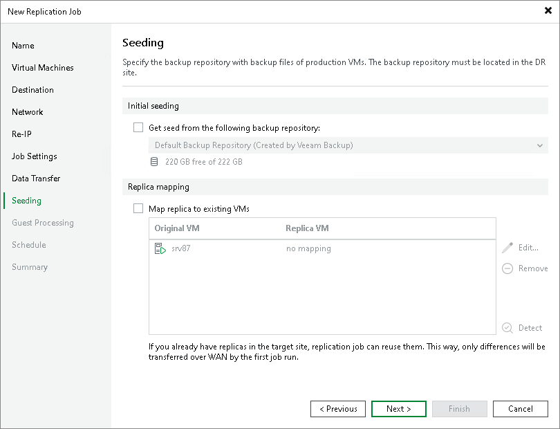

# Step 13. Define Seeding and Mapping Settings

The Seeding step is available if you have selected the Replica seeding check box at the [Job](replica_name_hv.md) step of the wizard.

At the Seeding step of the wizard, configure replica seeding and mapping. Seeding and mapping help reduce the amount of traffic sent during the initial replica synchronization. For more information on when to use seeding and mapping, see [Replica Seeding and Mapping](replica_seed_hv.md).

If you use replica seeding or mapping, make sure that you select correct backup infrastructure components for the job: source-side backup repository for metadata and backup proxies. It is recommended that you explicitly assign backup proxies in the production site and disaster recovery (DR) site. For more information, see [Specify Data Transfer Settings](replica_data_transfer_hv.md).

Also, if you plan to use seeding, make sure that you have backups of replicated VMs in a backup repository in the DR site. If you do not have the backups, create them as described in section [Creating Replica Seeds](replica_create_seed_hv.md).

|  |
| --- |
| Important |
| If the Replica seeding check box is enabled in a replication job, all VMs in the job must be covered with seeding or mapping. If a VM is neither has a seed, nor is mapped to an existing VM, it will be skipped from processing. |

Configuring Replica Seeding

To configure replica seeding:

1. Make sure that you have backups of replicated VMs in a backup repository in the DR site.

|  |
| --- |
| Important |
| Consider the following:   * Backups must be created by Veeam Backup & Replication.  * Backups must not reside in a scale-out backup repository. |

1. In the Initial seeding section, select the Get seed from the following backup repository check box.
2. From the list of available backup repositories, select the repository where your replica seeds are stored.

|  |
| --- |
| Note |
| If a VM has a seed and is mapped to an existing replica, replication will be performed using replica mapping because mapping has a higher priority. |

Configuring Replica Mapping

To configure replica mapping:

1. Select the Map replicas to existing VMs check box.
2. If you want Veeam Backup & Replication to scan the DR site to detect existing copies of VMs that you plan to replicate, click Detect.

If any matches are found, Veeam Backup & Replication will populate the mapping table. If Veeam Backup & Replication does not find a match, you can map a VM to its copy manually.

1. If you want to map a VM manually, select a source VM from the list, click Edit and select the copy of this VM on the target host in the DR site.

If there is no existing VM replica in the DR site, you can restore a VM from the backup and map it to the source VM.

To remove a mapping association, select a VM in the list and click Remove.

|  |
| --- |
| Note |
| The mapping list does not display VMs added to the list of exclusions. For more information, see [Exclude Objects from Replication Job](replica_exclude_hv.md). |

