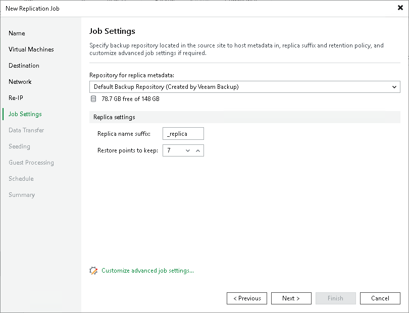

# Step 10. Specify Replication Job Settings

At the Job Settings step of the wizard, specify a backup repository for storing replica metadata, replica name and number of restore points to keep:

1. From the Repository for replica metadata list, select a backup repository that will store metadata for VM replicas. For more information on the recommended repository location, see Backup Infrastructure for Replication.

|  |
| --- |
| Important |
| Consider the following:   * You cannot store VM replica metadata on deduplicating storage appliances. During replication jobs, Veeam Backup & Replication frequently reads and writes small portions of metadata from/to the backup repository. Frequent access to metadata causes low performance of deduplicating storage appliances, which may result in low performance of replication jobs.  * You cannot store replica metadata in a scale-out backup repository or object storage repository. |

1. In the Replica name suffix field, enter a suffix that will be added to the source VM names. To register a VM replica on the target host, Veeam Backup & Replication appends the specified suffix to the name of the source VMs.
2. In the Restore points to keep field, specify the number of restore points that the replication job must maintain. Due to VMware restrictions on the number of VM snapshots, the maximum number of restore points for VM replicas is limited to 28. When the specified number is exceeded, Veeam Backup & Replication removes the earliest restore points.

Related Topics

[Backup Infrastructure for Replication](replication_components.md#repo_vm)

