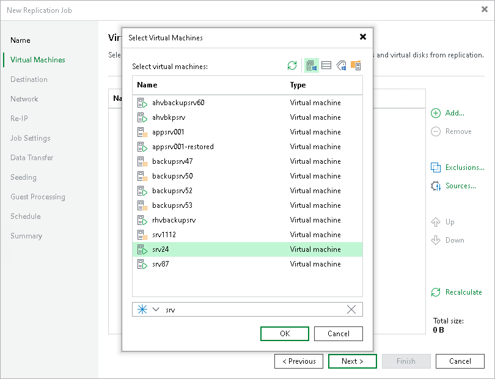

# Step 3. Select VMs to Replicate

At the Virtual Machines step of the wizard, select VMs and VM containers that you want to replicate:

1. Click Add.
2. In the Add Object window, select the necessary VMs or VM containers and click Add.

If you select VM containers and add new VMs to this container in future, Veeam Backup & Replication will update replication job settings automatically to include these VMs.

The total size of objects added to the job is displayed in the Total size field. Use the Recalculate button to refresh the total size value after you add a new object to the job.

