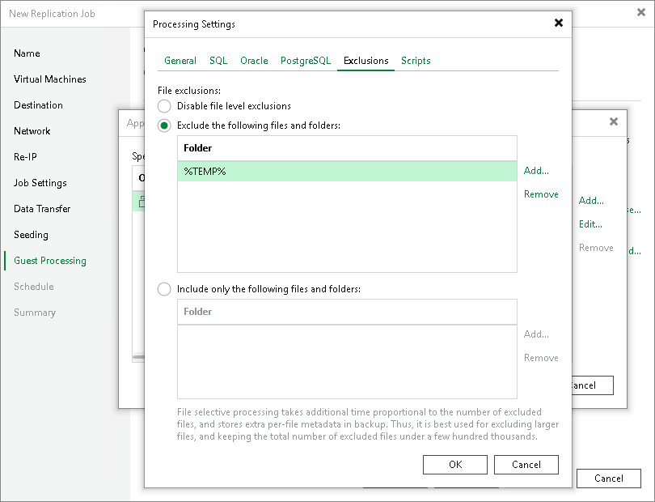

# VM Guest OS File Exclusion Settings

These settings apply only to Microsoft Windows workloads.

To configure VM guest OS file exclusion Settings, you must check that application-aware processing is enabled and then specify exclusion settings.

Enabling Application-Aware Processing

Before configuring transaction log processing, check that application-aware processing is enabled:

1. At the Guest Processing step of the wizard, select the Enable application-aware processing check box.
2. Click Application handling options for individual machines.
3. In the displayed list, select workloads for which you want to configure application-aware processing and click Edit.

To define custom settings for a VM added as a part of a VM container, you must include the VM in the list as a standalone object. To do this, click Add and choose the necessary VM. Then select the VM in the list and define the necessary settings.

1. In the Processing Settings window, on the General tab, check that Require successful processing or Try application processing, but ignore failures option is selected in the Applications area.

Specifying VM Guest OS File Exclusion Settings

To exclude guest OS files and folders from being replicated:

1. In the Processing Settings window, switch to the Exclusions tab and specify whether you want to exclude or include files and folders:

+ To remove individual files and folders from replicas, select Exclude the following files and folders and click Add.
+ To include only the specified files and folders in replicas, select Include only the following files and folders and click Add.

1. In the Specify Folder window, specify which files and folders you want to include or exclude. For the methods that you can use to specify the list of exclusions or inclusions, see [VM Guest OS Files](guest_file_exclusion.md).

|  |
| --- |
| Note |
| When you select files to be included or excluded, consider requirements and limitations that are listed in section [Requirements and Limitations for VM Guest OS File Exclusion](guest_file_exclusion.md#reqs). |

