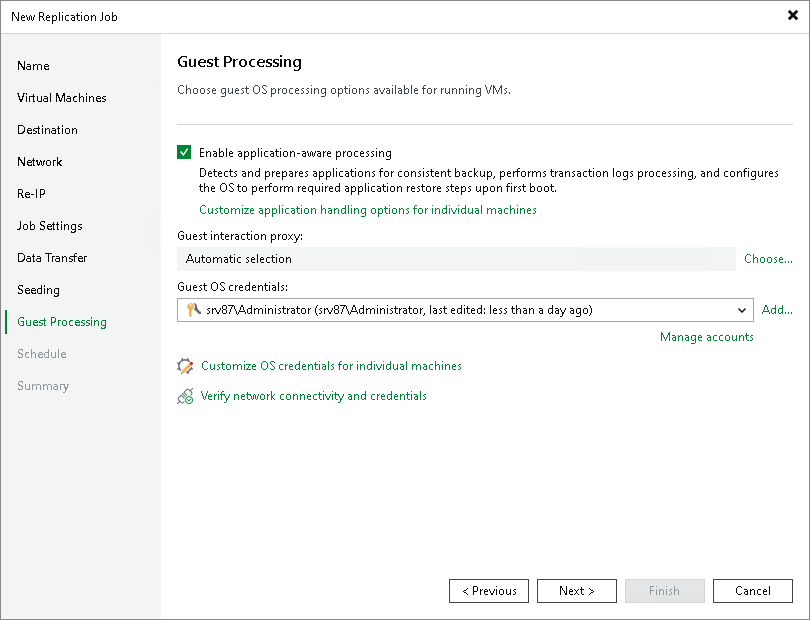

# Step 14. Specify Guest Processing Settings

At the Guest Processing step of the wizard, enable guest OS processing that allows you to create transactionally consistent replicas, exclude files from processing, and use pre-freeze and post-thaw scripts. For more information on guest OS processing, see the [Guest Processing](guest_processing_hv.md) section.

To enable guest OS processing:

1. Select Enable application-aware processing.
2. If you have added Microsoft Windows VMs to the job, specify which guest interaction proxy Veeam Backup & Replication can use to perform different guest processing tasks:

* If you want Veeam Backup & Replication to select the guest interaction proxy automatically, leave Automatic selection on the Guest interaction proxy field.
* If you want to explicitly specify which servers will perform the guest interaction proxy role, click Choose. In the Guest Interaction Proxy window, click Prefer the following guest interaction proxy server, and select the necessary proxies.

For more information on the guest interaction proxy,requirements and limitations for it, see [Guest Interaction Proxy](guest_interaction_proxy.md).

1. From the Guest OS credentials list, select a user account that has enough permissions. For more information on the permissions and requirements for the user account, see [Permissions for Guest Processing](required_permissions.md#rptcb).

Veeam Backup & Replication will use the account to connect to guest OSes and deploy the non-persistent runtime components or use (if necessary, deploy) persistent agent. For more information on guest agent and non-persistent components, see [Non-Persistent Runtime Components and Persistent Agent Components](runtime_process_hv.md).

If you have not set up credentials beforehand, click the Manage accounts link or click the Add button to add credentials. For more information on adding credentials, see the [Credentials Manager](credentials_manager.md) section.

1. To specify other credentials for individual VMs, click Credentials. Then select the necessary VM and set user credentials for it.
2. To check whether Veeam Backup & Replication can connect to VMs using the specified guest OS credentials and can deploy the non-persistent runtime components or connect to persistent agent components on the guest OSes, click Test Now.

After you have enabled guest OS processing, configure the following guest processing options:

* [Application-aware processing](replica_vss_application_hv.md)
* [Microsoft SQL Server transaction log settings](replica_vss_transaction_sql_hv.md)
* [Oracle archived log settings](replica_vss_transaction_oracle_hv.md)
* [Postgre SQL settings](replica_vss_postgresql_hv.md)
* [VM guest OS file exclusion](replica_vss_exclusion_hv.md)
* [Pre-freeze and post-thaw scripts](replica_vss_scripts_hv.md)

