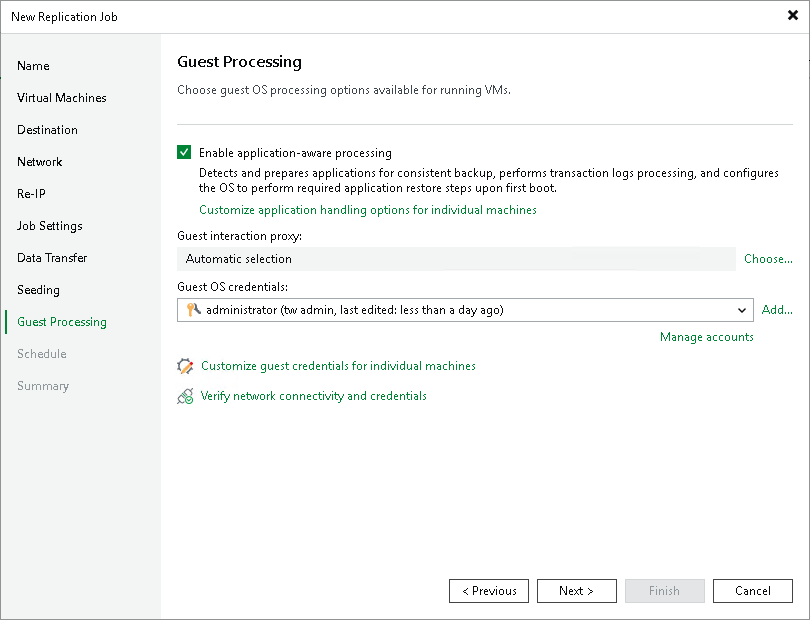

# Step 14. Specify Guest Processing Settings

At the Guest Processing step of the wizard, enable and configure guest OS processing.

Guest OS processing involves application-aware processing that allows creation of transactionally consistent replicas and guest file system indexing (however, indexing is not available for replicas). In its turn, application-aware processing includes log truncation, execution of custom scripts and guest OS file exclusions. For more information on guest processing, see the [Guest Processing](guest_processing.md) section.

To be able to use guest processing, you must also configure user accounts to access guest OSes and guest interaction proxies.

To enable guest OS processing and start configuring it (accounts and guest interaction proxies):

1. Select Enable application-aware processing.

When you select this option, Veeam Backup & Replication enables application-aware processing with the default settings for all VMs. You can further disable application-aware processing for individual VMs and reconfigure the default settings.

1. If you have added Microsoft Windows VMs to be processed, specify which guest interaction proxy Veeam Backup & Replication can use to perform different guest processing tasks:

* If you want Veeam Backup & Replication to select the guest interaction proxy automatically, leave Automatic selection on the Guest interaction proxy field.
* If you want to explicitly specify which servers will perform the guest interaction proxy role, click Choose. In the Guest Interaction Proxy window, click Prefer the following guest interaction proxy server, and select the necessary proxies.

For more information on the guest interaction proxy, requirements and limitations for it, see [Guest Interaction Proxies](guest_interaction_proxy.md).

1. From the Guest OS credentials list, select a user account that will be used to connect to guest OSes and that has enough permissions. For more information on the permissions and requirements for the user account, see [Permissions for Guest Processing](required_permissions.md#rptcb).

[For Microsoft Windows VMs] Veeam Backup & Replication will also use this account to deploy the non-persistent runtime components or use (if necessary, deploy) persistent agent. For more information on guest agent and non-persistent components, see [Non-Persistent Runtime Components and Persistent Agent Components](runtime_process.md).

[For Linux VMs] If you installed persistent agent components for VMs running Linux or Unix operating systems, select Use management agent credentials from the list. For more information, see [Persistent Agent Components](persistent_agent_components.md).

If you have not set up credentials beforehand, click the Manage accounts link or click the Add button to add credentials. For more information on adding credentials, see the [Credentials Manager](credentials_manager.md) section.

|  |
| --- |
| Note |
| If you plan to use Kerberos authentication, check limitations and requirements listed in section [Guest Processing](guest_processing.md). |

1. To specify credentials for individual workloads, click Guest OS credentials for individual machines. Then select the necessary workload and set user credentials for it.

To define custom settings for a VM added as a part of a VM container, you must include the VM in the list as a standalone object. To do this, click Add and choose a VM whose settings you want to customize. Then select the VM in the list and define the necessary settings.

1. To check whether Veeam Backup & Replication can connect to VMs using the specified guest OS credentials and can deploy the non-persistent runtime components or connect to persistent agent components on the guest OSes, click Verify network connectivity and credentials.

After you have enabled application-aware processing for all VMs and configured other settings required for guest processing, you can disable application-aware processing for individual VMs and change the default settings. For more information, see the following sections:

* [Application-aware processing general settings](replica_vss_application_vm.md)
* [Microsoft SQL Server transaction log settings](replica_vss_transaction_sql_vm.md)
* [Oracle archived log settings](replica_vss_transaction_oracle_vm.md)
* [PostgreSQL settings](replica_vss_postgresql_vm.md)
* [VM guest OS file exclusion](replica_vss_exclusion_vm.md)
* [Pre-freeze and post-thaw scripts](replica_vss_scripts_vm.md)

