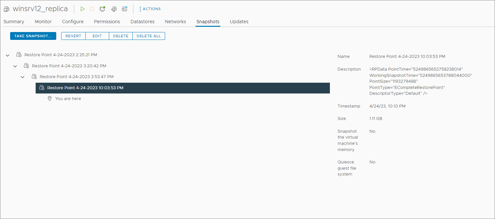

# Replication Chain

In this article

For every VM replica, Veeam Backup & Replication creates a replication chain that consists of restore points. Veeam Backup & Replication utilizes VMware ESXi snapshot capabilities to create and manage replica restore points.

Veeam Backup & Replication creates a restore point during every replication job session. During the first replication job session, Veeam Backup & Replication creates a copy of the source VM on the target host. During every subsequent replication job session, it adds a new snapshot to the replication chain for the VM replica. Blocks of data that have changed since the last job run are written to the snapshot delta file, and the snapshot delta file acts as a restore point. You can view a replication chain created for a VM using VMware vSphere client.

You can specify how many restore points you want to store in the replication chain. For this, configure retention policy settings for the replication job. For more information, see [Specify Replication Job Settings](replica_settings_vm.md).

VM replica restore points are stored in a native VMware vSphere format next to replica virtual disk files, which allows Veeam Backup & Replication to accelerate failover operations. To fail over to the necessary point of the VM replica, Veeam Backup & Replication does not need to apply rollback files. Instead, it uses a native VMware vSphere mechanism of reverting to a snapshot.

|  |
| --- |
| Important |
| We recommend you against switching restore points for replicas and powering on replicas using VMware vSphere client. This may disrupt further replication operations in Veeam Backup & Replication or cause loss of important data. Instead, use Veeam Backup & Replication to perform failover operations. For more information on how to fail over to a VM replica, see [Failover](failover.md). |

Page updated 1/22/2025

Page content applies to build 13.0.1.1071
