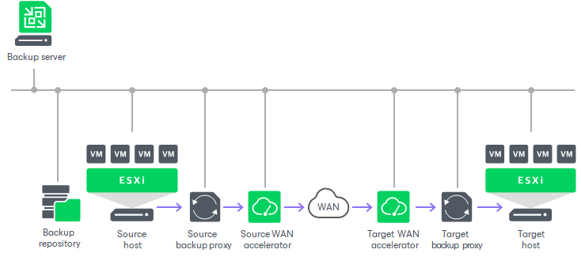

# Backup Infrastructure for Replication

In this article

Veeam Backup & Replication uses the following components for the replication process:

* [Backup server](replication_components.md#bs_vm)
* [Source and target hosts](replication_components.md#hosts_vm)
* [Backup proxies](replication_components.md#proxy_vm)
* [Backup repository](replication_components.md#repo_vm)
* [Optional] [WAN accelerators](replication_components.md#wan_vm)

The amount and placement of these components depend on a replication scenario you use. For more information, see [Replication Scenarios](replication_scenarios.md).

Backup Server

During the replication process, the backup server coordinates replication tasks, controls resource allocation and replica job scheduling. The backup server runs the Veeam Backup Service and Veeam Broker Service that coordinate and interact with the virtual infrastructure.

For more information on the backup server, see [Backup Server](backup_server.md).

Source and Target Hosts

The source host is the host where VMs that you plan to replicate are located. The target host is the host where VM replicas will be created and maintained in the ready-to-start state.

The role of a target host can be assigned to a standalone ESXi host or ESXi cluster. If you assign a cluster or vCenter Server as a target, the replication process becomes more sustainable — the replication process will not fail if there is at least one available host in the cluster.

To replicate data from and to hosts, they must be first added to the Veeam Backup & Replication infrastructure. For more information on how to add hosts, see the [Adding VMware vSphere Servers](add_vmware_server.md) section.

Backup Proxies

A backup proxy collects, transforms and transports VM data during the replication process. For more information on backup proxies, requirements and limitations for them, see [Backup Proxy](backup_proxy.md).

For replication, you can deploy backup proxies on the following machines:

* Physical machines. In this case, Veeam Backup & Replication uses the Network transport mode to populate replica disk files. For more information, see [Network Mode](network_mode.md).
* VMs. The virtual backup proxy must be registered on an ESXi host that has a direct connection to the target datastore. In this case, the backup proxy will be able to use the Virtual appliance transport mode to populate replica disk files. This results in increased writing speed and fail-safe replication to ESXi targets. For more information, see [Virtual Appliance (HotAdd)](virtual_appliance.md). Note that if the Virtual appliance transport mode cannot be used, the backup proxy can fail over to the network mode if you configure it while adding a backup proxy.

We recommend you to use at least two backup proxies to ensure that the job will be performed if one of backup proxies fails or loses its connectivity to the source datastore. For more information on how assign the role of a backup proxy, see [Adding VMware Backup Proxies](add_vmware_proxy.md). For more information on how to assign proxies to a replication job, see [Specify Data Transfer Settings](replica_data_transfer_vm.md).

Backup Repository

The backup repository stores replica metadata that contains information on the read data blocks (such as checksums and digests). Metadata is required when Veeam Backup & Replication performs incremental replication or if you fail back from a VM replica to the source VM in the original location using [quick rollback](failback_quick_rollback.md). Veeam Backup & Replication uses metadata to quickly detect changed data blocks between two replica states.

The backup repository must have access to the source backup proxy. We recommend to deploy the backup repository as close to the source backup proxy as possible.

For more information, see [Backup Repository](backup_repository.md).

WAN Accelerators

WAN accelerators are optional components in the backup infrastructure. You can use WAN accelerators if you replicate VMs over a slow connection or over WAN.

In the replication process, WAN accelerators are responsible for global data caching. To use WAN acceleration, you must deploy two WAN accelerators in the following way:

* The source WAN accelerator must be deployed in the source side, close to the backup proxy.
* The target WAN accelerator must be deployed in the target side, close to the backup proxy.

For more information, see [WAN Acceleration](wan_acceleration.md).

Related Topics

[Replication Scenarios](replication_scenarios.md)

Page updated 1/22/2025

Page content applies to build 13.0.1.1071
