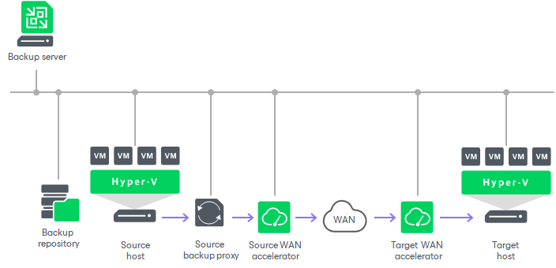

# Backup Infrastructure for Replication

Veeam Backup & Replication uses the following components for the replication process:

* [Backup server](#bs_hv)
* [Source and target hosts](#hosts_hv)
* [Optional] [Off-host backup proxy](#proxy_hv)
* [Backup repository](#repo_hv)
* [Optional] [WAN accelerators](#wan_hv)

Backup Server

During the replication process, the backup server coordinates replication tasks, controls resource allocation and replica job scheduling. The backup server runs the Veeam Backup Service that coordinates all replication operations.

For more information on the backup server, see [Backup Server](backup_server.md).

Source and Target Hosts

The source host is the host where VMs that you plan to replicate are located. The target host is the host where VM replicas will be created and maintained in the ready-to-start state.

The role of a target host can be assigned to a standalone Microsoft Hyper-V host or Microsoft Hyper-V cluster. If you assign a cluster as a target, the replication process becomes more sustainable — the replication process will not fail if there is at least one available host in the cluster.

To replicate data from and to hosts, they must be first added to the Veeam Backup & Replication infrastructure. For more information on how to add Microsoft Hyper-V to the backup infrastructure, see the [Adding Microsoft Hyper-V Servers](add_hyperv_server.md) section.

Off-Host Backup Proxies

An off-host backup proxy collects, transforms and transports VM data during the replication process. For more information on off-host backup proxies, requirements and limitations for them, see [Off-Host Backup Proxy](offhost_backup_proxy.md).

You can use one backup proxy, however, we recommend you to use at least two backup proxies to ensure that the job will be performed if one of backup proxies fails or loses its connectivity to the source storage. For more information on how assign the role of a backup proxy, see [Adding Off-Host Backup Proxies](add_hyperv_proxy.md). For more information on how to assign proxies to a replication job, see [Specify Data Transfer Settings](replica_data_transfer_hv.md).

Backup Repository

The backup repository stores replica metadata that contains information on the read data blocks (such as checksums and digests). Metadata is required when Veeam Backup & Replication performs incremental replication or if you fail back from a VM replica to the source VM in the original location using [quick rollback](failback_quick_rollback_hv.md). Veeam Backup & Replication uses metadata to quickly detect changed data blocks between two replica states.

The backup repository must be deployed in the source site, as close to the source host as possible.

For more information, see [Backup Repository](backup_repository.md).

WAN Accelerators

WAN accelerators are optional components in the backup infrastructure for replication. You can use WAN accelerators if you replicate VMs over a slow connection or over WAN.

In the replication process, WAN accelerators are responsible for global data caching. To use WAN acceleration, you must deploy two WAN accelerators in the following manner:

* The source WAN accelerator must be deployed in the source side, close to the source host or off-host backup proxy.
* The target WAN accelerator must be deployed in the target side, close to the target host.

For more information, see [WAN Acceleration](wan_acceleration.md).

Related Topics

[Replication Scenarios](replication_scenarios_hv.md)

