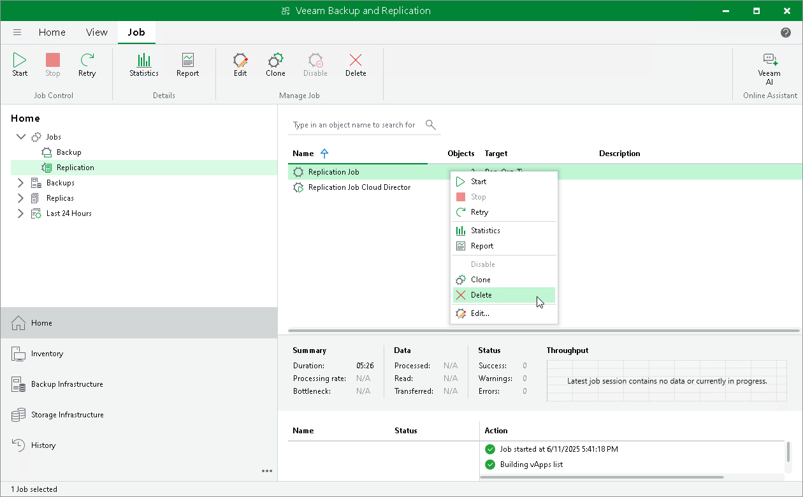

# Managing Cloud Director Replication Jobs

After you create VMware Cloud Director replication jobs, you can edit, disable and delete them.

To view all created VMware Cloud Director replication jobs, open the Home view and navigate to the Jobs > Replication node. The working area displays the full list of the created replication jobs. Here, you can manage the jobs.

You can manage VMware Cloud Director replication jobs with the following options:

* [Retrying VMware Cloud Director Replication Jobs](#retry)
* [Editing VMware Cloud Director Replication Jobs](#edit)
* [Disabling VMware Cloud Director Replication Jobs](#disable)
* [Deleting VMware Cloud Director Replication Jobs](#delete)

Retrying Cloud Director Replication Jobs

The retry option is necessary when a VMware Cloud Director job fails and you want to retry this operation again. When you perform a retry, Veeam Backup & Replication restarts the same procedure only for the failed VMs added to the vApp and will not process VMs that have been processed successfully. As a result, the replication job will take less time and will not consume as many resources as when processing a whole vApp.

To a retry a failed VMware Cloud Director replication job:

1. Open the Home view.
2. In the inventory pane, navigate to the Jobs > Replication node.
3. In the working area, select the necessary VMware Cloud Director replication job and select Retry on the ribbon. Alternatively, you can right-click the necessary VMware Cloud Director replication job and select Retry.

Editing Cloud Director Replication Jobs

To edit a VMware Cloud Director replication job:

1. Open the Home view.
2. In the inventory pane, navigate to the Jobs > Replication node.
3. In the working area, select the necessary VMware Cloud Director replication job and select Edit on the ribbon. Alternatively, you can right-click the necessary VMware Cloud Director replication job and select Edit.
4. Follow the instructions provided in [Creating Cloud Director Replication Job](creating_vcd_replication_job.md).

Disabling Cloud Director Replication Jobs

After you disable the job, Veeam Backup & Replication will pause it and will not process this job according the specified schedule. You can enable a disabled job at any time.

To disable a VMware Cloud Director replication job:

1. Open the Home view.
2. In the inventory pane, navigate to the Jobs > Replication node.
3. In the working area, select the necessary policy and select Disable on the ribbon. Alternatively, you can right-click the necessary policy and select Disable.

|  |
| --- |
| Tip |
| To enable a disabled VMware Cloud Director replication job, select it and click Disable once again. |

Deleting Cloud Director Replication Jobs

After you delete the job, the replicas created by this job are displayed under the Replicas node. Veeam Backup & Replication allows you to delete only stopped VMware Cloud Director replication jobs. You can also permanently delete a job from Veeam Backup & Replication and from the configuration database.

Veeam Backup & Replication allows you to delete only disabled VMware Cloud Director replication jobs.

To delete a VMware Cloud Director replication job:

1. Open the Home view.
2. In the inventory pane, navigate to the Jobs > Replication node.
3. In the working area, select the necessary VMware Cloud Director replication job and select Delete on the ribbon. Alternatively, you can right-click the necessary VMware Cloud Director replication job and select Delete.

