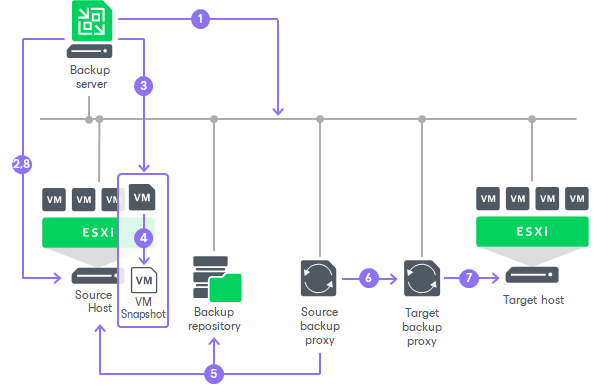

# How Replication Works

Veeam Backup & Replication performs VM replication in the following way:

1. When a new replication job session starts, Veeam Backup & Replication reads job settings from the configuration database, checks what backup infrastructure resources are available and prepares the backup infrastructure for replication.
2. Veeam Backup & Replication queries information about VMs and virtualization hosts from the vCenter Server.
3. If application-aware image processing is enabled for the job, Veeam Backup & Replication connects to VM guest OSes, deploys non-persistent runtime components or uses (if necessary, deploys) persistent agent components on VM guest OSes and performs in-guest processing tasks.
4. Veeam Backup & Replication requests vCenter Server or ESXi host to create a VM snapshot. VM disks are put to the read-only state, and every virtual disk receives a delta file. All changes that the user makes to the VM during replication are written to delta files.
5. The source backup proxy reads the VM data from the read-only VM disk and copies it.

During incremental job sessions, the source proxy uses [changed block tracking (CBT)](changed_block_tracking.md) to retrieve only those data blocks that have changed since the previous job session. If CBT is not available, the source proxy interacts with the backup repository to obtain replica metadata, and uses this metadata to detect blocks that have changed since the previous job session.

While copying VM data, the source proxy performs additional processing. It filters out zero data blocks, blocks of swap files and blocks of excluded VM guest OS files.

1. The source proxy compresses VM data and transports it to the target proxy.
2. The target proxy decompresses VM data and writes the result to the destination datastore.
3. After the backup proxy finishes reading VM data, Veeam Backup & Replication requests the vCenter Server or ESXi host to commit the VM snapshot and delta disks into the VM.

