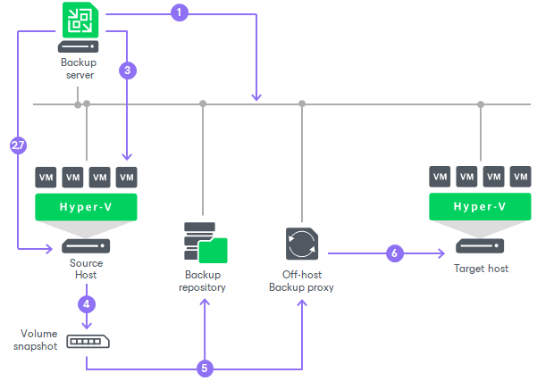

# How Replication Works

In this article

Veeam Backup & Replication performs VM replication in the following way:

1. When a new replication job session starts, Veeam Backup & Replication reads job settings from the configuration database, checks what backup infrastructure resources are available and prepares the backup infrastructure for replication.
2. Veeam Backup & Replication queries information about VMs and virtualization hosts from Microsoft Hyper-V.
3. If application-aware image processing is enabled for the job, Veeam Backup & Replication connects to VM guest OSes, deploys non-persistent runtime components or uses (if necessary, deploys) persistent agent components on VM guest OSes and performs in-guest processing tasks.
4. Veeam Backup & Replication requests Microsoft Hyper-V VSS to create a cohesive point-in-time copy of a VM. Microsoft Hyper-V VSS creates a volume snapshot or VM checkpoint, depending on the hypervisor version.
5. The source backup proxy reads the VM data from the volume snapshot or VM checkpoint and copies it. During incremental job sessions, the source proxy uses [changed block tracking (CBT)](changed_block_tracking_hv.md) to retrieve only those data blocks that have changed since the previous job session. If CBT is not available, the source proxy interacts with the backup repository to obtain replica metadata, and uses this metadata to detect blocks that have changed since the previous job session.

While copying VM data, the source proxy performs additional processing. It filters out zero data blocks, blocks of swap files and blocks of excluded VM guest OS files.

1. The source proxy compresses VM data and transports it to the target host. The target host decompresses VM data and writes the result to the destination datastore.
2. After the backup proxy finishes reading VM data, Veeam Backup & Replication requests Microsoft Hyper-V VSS to delete the volume snapshot or VM checkpoint.

Veeam Backup & Replication can resume the replication process if data transfer was not finished, for example, if the replication job did not finish within the allowed backup window or the network connection failed. On the next run, Veeam Backup & Replication will continue data transfer for those disks for which Veeam Backup & Replication has started data processing and created snapshots during the current run.

Page updated 1/28/2025

Page content applies to build 13.0.1.1071
