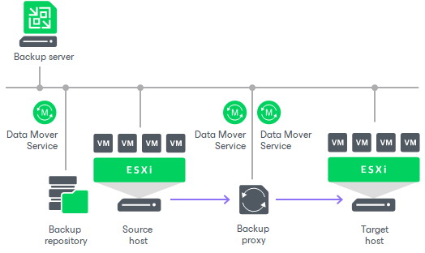
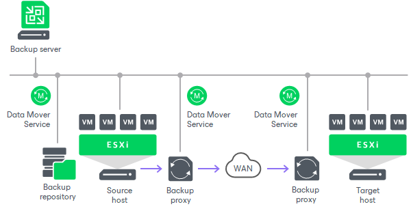

# Replication Scenarios

In this article

Veeam Backup & Replication supports a number of replication scenarios that depend on the location of the target host:

* On-site replication. If the target host is located in the same site as the source host, use the on-site replication scenario.
* Off-site replication. If the target and source hosts are located in different sites, use the off-site replication scenario.

Depending on the scenario you are planning to use, different backup infrastructure components will be involved in the replication process. For more information on the components, see [Backup Infrastructure for Replication](replication_components.md).

On-Site Replication

On-site replication requires the following backup infrastructure components:

* Source and target hosts.
* Backup proxy. In the on-site replication scenario, the source [Veeam Data Mover](veeam_transport_service.md) and target Veeam Data Mover are started on the same backup proxy. The backup proxy must have access to the backup server, source host, target host and backup repository that stores replica metadata.
* Backup repository for storing replica metadata.

In the on-site replication scenario, Veeam Backup & Replication does not perform data compression. Replication traffic is transferred decompressed between the two Veeam Data Mover started on the same backup proxy.

Off-Site Replication

For the off-site replication scenario, you must use at least two backup proxies:

* One backup proxy in the production site, closer to the source host.
* One backup proxy in the remote DR site, closer to the target host.

Depending on the network speed between the production and DR sites, off-site replication can run in two ways:

* Directly over backup proxies. Transfer data directly over backup proxies if the connection between two sites is fast and stable.
* Over a pair of WAN accelerators. Use WAN accelerators if the connection between the sites is slow.

|  |
| --- |
| Note |
| With off-site replication, you can also use technologies that help reduce the amount of replication traffic and streamline replica configuration: [replica seeding and mapping](replica_seeding.md), [network mapping](replica_network_vm.md) and [re-IP rules](replica_reip_vm.md). |

Replication Directly over Backup Proxies

Off-site replication directly over backup proxies requires the following backup infrastructure components:

* Source and target hosts.
* At least one backup proxy in the production site. The backup proxy must have access to the backup server, source host, backup proxy in the target site and backup repository that stores replica metadata.
* At least one backup proxy in the DR site. The backup proxy must have access to the backup server, target host and backup proxy in the production site.
* Backup repository for storing replica metadata.

In the off-site replication scenario, Veeam Backup & Replication uses data compression. Veeam Data Mover on the source backup proxy compresses VM data blocks and sends them to the target backup proxy in the compressed format. Veeam Data Mover on the target backup proxy decompresses VM data and stores it to a datastore in a native VMware vSphere format.

Replication over WAN Accelerators

Off-site replication over WAN accelerators requires the following backup infrastructure components:

* Source and target hosts.
* A pair of WAN accelerators at each end of the WAN link:

+ Source WAN accelerator in the production site. The source WAN accelerator must have access to the backup server, source backup proxy and target WAN accelerator.
+ Target WAN accelerator in the DR site. The target WAN accelerator must have access to the backup server, source WAN accelerator and target backup proxy.

* At least one backup proxy in the production site. The backup proxy must have access to the backup server, source host, source WAN accelerator and backup repository that stores replica metadata.
* At least one backup proxy in the DR site. The backup proxy must have access to the backup server, target host and target WAN accelerator.
* Backup repository for storing replica metadata. The backup repository must be located in the production site, closer to the source backup proxy, and must have access to it.

In the off-site replication scenario using WAN accelerators, Veeam Backup & Replication compresses VM data. VM data blocks are compressed on the source WAN accelerator, transported to the DR site in the compressed format and decompressed on the target WAN accelerator.

Page updated 8/26/2025

Page content applies to build 13.0.1.1071
