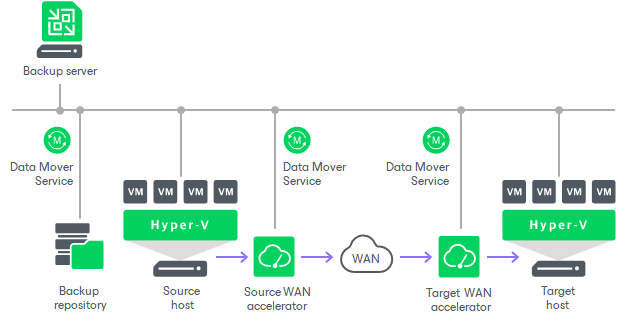
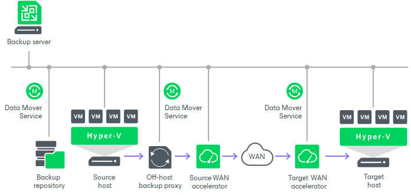

# Replication Scenarios

Veeam Backup & Replication supports a number of replication scenarios. Depending on the scenario you are planning to use, different backup infrastructure components will be involved in the replication process. For more information on the components, see [Backup Infrastructure for Replication](replication_components_hv.md).

* On-host replication. Use this scenario if you want the source Microsoft Hyper-V host to process VM data. This can result in high CPU usage and network overhead on the host system.
* Off-host replication. Use this scenario if the load on the source Microsoft Hyper-V is high and you want to shift VM data processing to a dedicated machine — an off-host backup proxy.

Both these scenarios can be used when the source and target hosts are located in the same site (on-site replication) and in different sites (off-site replication). In both scenarios, you can replicate VM data directly (between hosts, or off-host proxy and target host) or over a pair of WAN accelerators.

|  |
| --- |
| Note |
| With off-site replication, you can also use technologies that help reduce the amount of replication traffic and streamline replica configuration: [replica seeding and mapping](replica_seeding_hv.md), [network mapping](replica_network_hv.md) and [re-IP rules](replica_reip_hv.md). |

On-Host Replication

The on-host replication scenario requires the following backup infrastructure components:

* Source host. The source host runs the source [Veeam Data Mover](veeam_transport_service.md). Note that this can cause additional overhead on the source host.
* Target host. The target host runs the target Veeam Data Mover.
* Backup repository for storing replica metadata.
* [Optional] A pair of WAN accelerators at each end of the WAN link. Use WAN accelerators if the connection between the hosts is slow.

* Source WAN accelerator must be deployed near the source host. The source WAN accelerator must have access to the backup server, source host or off-host backup proxy and target WAN accelerator.
* Target WAN accelerator must be deployed near the target host. The target WAN accelerator must have access to the backup server, source WAN accelerator and target host.

During on-host replication, all the necessary data transformations (such as data compression and block filtering) are performed on the source host.

Off-Host Replication

The off-host replication scenario requires the following backup infrastructure components:

* Source host.
* Off-host backup proxy. The off-host backup proxy must be deployed in the source site and must have access to the source host and the target host. The off-host backup proxy runs the source Veeam Data Mover.
* Target host. The target host runs Veeam Data Mover.
* Backup repository for storing replica metadata.
* [Optional] A pair of WAN accelerators at each end of the WAN link. Use WAN accelerators if the connection between the hosts is slow.

* Source WAN accelerator must be deployed near the source host. The source WAN accelerator must have access to the backup server, source host or off-host backup proxy and target WAN accelerator.
* Target WAN accelerator must be deployed near the target host. The target WAN accelerator must have access to the backup server, source WAN accelerator and target host.

During off-host replication, all the necessary data transformations (such as data compression and block filtering) are performed on off-host backup proxy, which helps reduce unwanted overhead on the source host.

