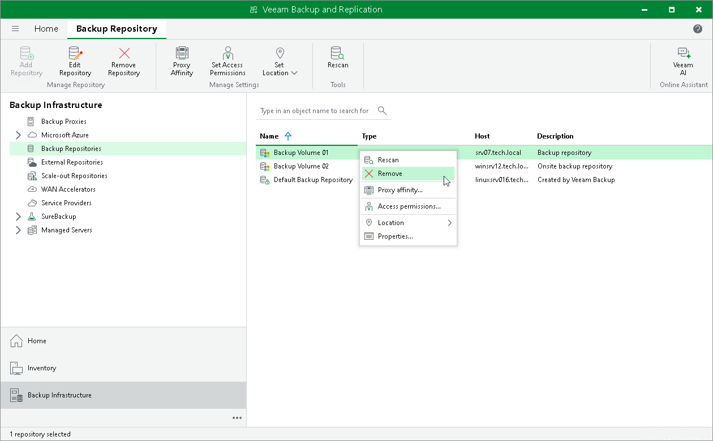

# Removing Backup Repositories

You can permanently remove a backup repository from the backup infrastructure. When you remove a backup repository, Veeam Backup & Replication unassigns the backup repository role from the server and this server is no longer used as a backup repository. The actual server remains in the backup infrastructure.

Veeam Backup & Replication does not remove backup files and other data stored in the backup repository. You can re-connect the backup repository at any time and import backups from this backup repository to Veeam Backup & Replication.

You cannot remove a backup repository that is used by any job. To remove such backup repository, you first need to delete a reference to this backup repository in the job settings. For more information, see [Editing Job Settings](editing_jobs.md).

To remove a backup repository:

1. Open the Backup Infrastructure view.
2. In the inventory pane, select the Backup Repositories node.
3. In the working area, select the backup repository and click Remove Repository on the ribbon or right-click the backup repository and select Remove.

