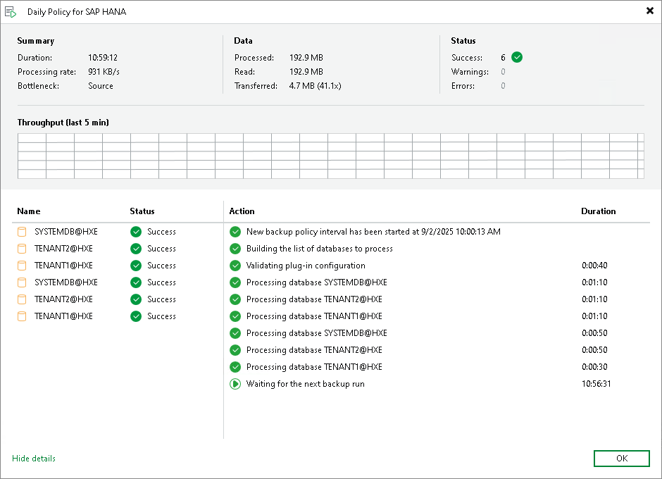
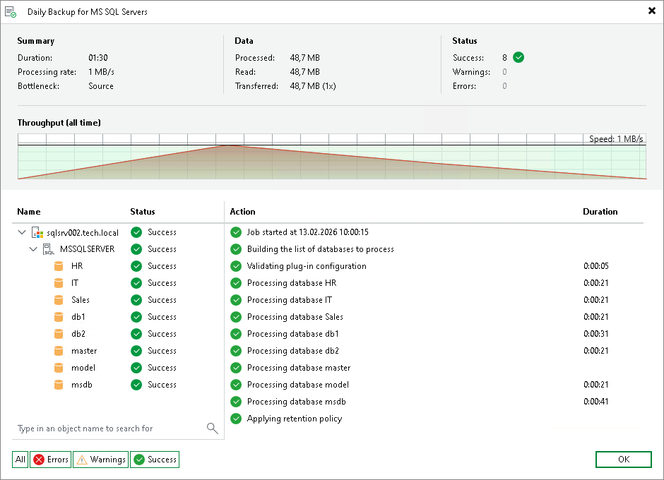

# Viewing Backup Policy Statistics

You can view statistics about application backup policies configured in Veeam Backup & Replication. Veeam Backup & Replication displays statistics in the following way:

After the application backup policy session statistics becomes available in Veeam Backup & Replication, this statistics appears in the policy statistics window. The job session statistics becomes available in Veeam Backup & Replication on real-time basis.

|  |
| --- |
| TIP |
| In addition to backup policy statistics, Veeam Backup & Replication displays individual backup session statistics for each computer in the backup policy. You can view these statistics in the Last 24 Hours node of the Home view and in the History view of the Veeam backup console. |

To view application backup policy statistics:

1. Open the Home view.
2. In the inventory pane, click the Jobs node.
3. In the working area, select the necessary statistics:

* To get statistics for database data backup, double-click the necessary application backup policy. Alternatively, you can select the necessary application backup policy and click Statistics > Instance backup on the ribbon or right-click the backup policy and select Statistics > Instance backup.
* To get statistics for database logs backup, select the necessary application backup policy and click Statistics > Database logs backup on the ribbon or right-click the backup policy and select Statistics > Database logs backup.

Additional Options for Monitoring Microsoft SQL Server Application Backup Policies

When multiple objects in a database are backed up, you can use the search bar and status filters at the bottom of the statistics window to find specific object names. The search and filter options are also available in the job progress window. This functionality is available for application backup policies created with Veeam Plug-In for Microsoft SQL Server.

