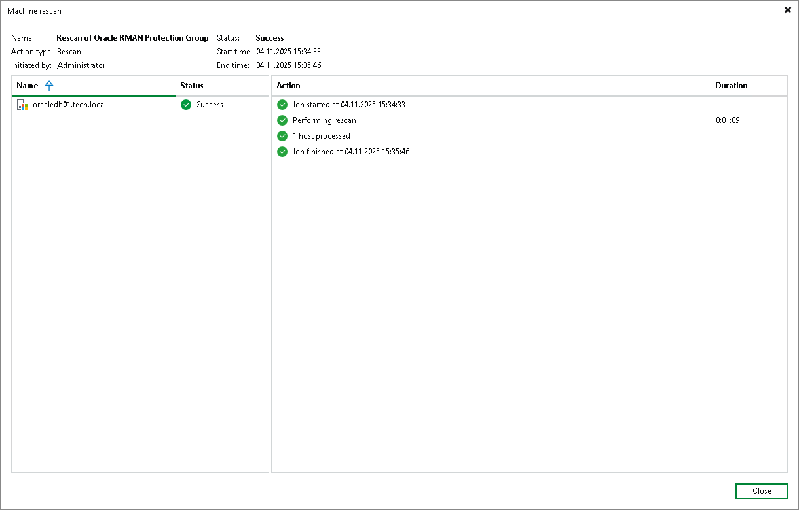

# Viewing Rescan Job Statistics

You can view statistics about performed rescan job sessions. When you create a protection group or manually start the discovery process for a protection group or individual protected computer, Veeam Backup & Replication displays statistics for the currently running rescan job session. In the statistics window, Veeam Backup & Replication displays session duration details and a list of operations performed during the job.

In addition to overall rescan job statistics, the statistics window provides information on each protected computer processed within the rescan job session. To view the processing progress for a specific computer, select it in the list on the left.

You can also view statistics for any performed rescan job session. To view rescan job statistics, do one of the following:

* Open the Inventory view. In the inventory pane, select the necessary protection group and click Statistics on the ribbon or right-click the protection group and select Statistics.
* Open the History view. In the inventory pane, select the System node. In the working area, select the necessary rescan job session and click Statistics on the ribbon or right-click the rescan job session and select Statistics.

