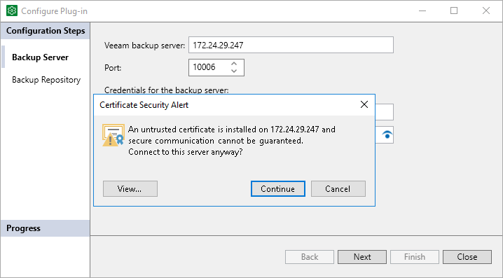
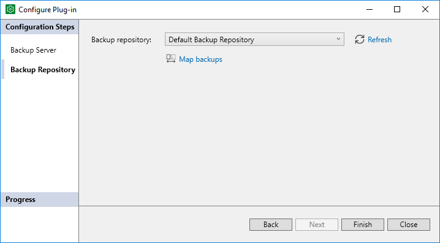

# Veeam Backup Repositories

In this article

Veeam Plug-Ins store backup files in repositories added to the Veeam Backup & Replication infrastructure. This section lists supported types of backup repositories and limitations for Veeam Plug-In for Microsoft SQL Server backups.

Before you start performing operations on backup repositories within the Veeam Backup & Replication infrastructure, consider that you need to set the access permissions for each repository. For details, see [Access and Encryption Settings on Backup Repositories](repository_permissions_mssql.md).

Supported Backup Repositories

You can use the following types of repositories added to the Veeam Backup & Replication infrastructure to store backups created with Veeam Plug-In for Microsoft SQL Server:

* [Windows Server](ms_server.md)
* [Linux Server](linux_server.md)

* [SMB (CIFS) Share](smb_share.md)

* [NFS Share](nfs_share.md)

* [Dell Data Domain with Data Domain Boost (DDBoost)](dell_dd.md)
* [HPE StoreOnce](deduplicating_appliance_storeonce.md)

If you plan to use HPE StoreOnce as a backup repository for Veeam Plug-In backups, the total number of stored files (data and metadata) must not exceed 3,000,000 per Catalyst store. If necessary, multiple Catalyst stores may be created on the same StoreOnce system.

* [Quantum DXi](deduplicating_appliance_quantum.md)

* [ExaGrid](deduplicating_appliance_exgrid.md)

Make sure the repository is configured as described in the [ExaGrid](deduplicating_appliance_exgrid.md) section.

* [Hardened Repository](hardened_repository.md)

* [Object Storage Repository](object_storage_repository.md)

* [Scale-Out Backup Repository](backup_repository_sobr.md)

Make sure that the performance extents of the scale-out backup repository contain repositories supported by Veeam Plug-In for Microsoft SQL Server. For example, you cannot use object storage repositories as performance extents to keep backups created with Veeam Plug-Ins.

Backup Repository Limitations

* For Veeam Plug-In backups, the warning which indicates that free space on a storage device has reached a specified threshold is configured in the veeam\_config.xml file of Veeam Plug-In. The warning settings in the Veeam Backup & Replication console does not affect this setting.

To configure the warning settings, add the following parameter in the veeam\_config.xml file:

|  |
| --- |
| <PluginParameters repositoryFreeSpacePercentWarning="10" /> |

Keep in mind that you must add the parameter to the existing line in the veeam\_config.xml file. If you create a new line with the same name as the existing line, Veeam Plug-In will consider parameters only in the first detected line. Other parameters will be ignored.

* You can set repository-based encryption for backups created with Veeam Plug-Ins. To learn more, see [Access and Encryption Settings on Backup Repositories](repository_permissions_mssql.md).

Alternatively, you can use transparent data encryption (TDE) provided by Microsoft. Using TDE, you can encrypt database data with an encryption key, back up encrypted data with Veeam Plug-In, then restore data and decrypt using the same encryption key. To learn more about TDE encryption, see [this Microsoft article](https://learn.microsoft.com/en-us/sql/relational-databases/security/encryption/transparent-data-encryption?view=sql-server-ver16).

* Veeam extract utility cannot extract Veeam Plug-In backup files. By design of Microsoft SQL Server, these files cannot be imported “as files” as they contain additional metadata bound to the used SBT device.

Veeam Scale-Out Backup Repositories

If you want to store Veeam Plug-In backups in [scale-out backup repositories](backup_repository_sobr.md), consider the following:

* You cannot rename a scale-out backup repository with Veeam Plug-In backups stored on this repository.

* If you want to add a backup repository as an extent to a scale-out backup repository and Veeam Plug-In backups are present on this backup repository, you must do the following:

1. In the Veeam Backup & Replication console, select Veeam Plug-In backup files that reside in this backup repository and remove them from configuration. For details, see [Removing Backups from Configuration](remove_from_backups.md). Note that this action does not delete the backups from the repository.
2. In the Veeam Backup & Replication console, delete the Veeam Plug-In backup job. For details, see [Deleting Jobs](disabling_jobs.md#deleting-job).
3. Add the repository as an extent to the scale-out repository. For details, see [Extending Scale-Out Repositories](sobr_add_extent.md).
4. Rescan the scale-out repository. For details, see [Rescanning Scale-Out Repositories](sobr_rescan.md).

|  |
| --- |
| Note |
| [For imports to the scale-out backup repository] Before importing your backup, consider that the names of all backup files (.VAB, .VASM, .VACM) and paths to these files contain only the following allowed characters:   * a-zA-Z0-9 * \_-.+=@^   If your backup was initially created on a standalone backup server, the default name of the backup metadata file (.VACM) contains forbidden characters. Before importing, you must delete forbidden characters from the file name or replace them with the allowed characters. |

1. On the Veeam Plug-In server, launch the Configure Plug-In wizard and set the scale-out repository as the target for backups:

Alternatively, you can use the following command in the command line interface:

|  |
| --- |
| MSSQLConfigTool --set-repository |

1. If you connect to the specified Veeam Backup & Replication server for the first time, Veeam Plug-In displays the Certificate Security Alert window. After you review the certificate, click Continue to confirm the connection.

1. At the Backup Repository step of the wizard:

1. From the Backup repository drop-down list, select the scale-out repository.
2. Click Map backups to map the imported backups stored in the backup repository.

|  |
| --- |
| Note |
| You can map backups only in the graphic user interface. |

* For Veeam Plug-In backups and backup copies, the Performance policy of a scale-out repository functions differently:

1. Veeam Backup & Replication checks if there are extents without warning on free space insufficiency. If all extents have the warning, Veeam Backup & Replication uses an extent with the largest amount of free space that has a free task slot.
2. If there are extents without the warning, Veeam Backup & Replication checks if there are incremental extents with free task slots. If there are no incremental extents with free task slots, Veeam Backup & Replication uses a full extent with the least amount of used task slots.
3. If there are incremental extents with free task slots, Veeam Backup & Replication sends backup files to an incremental extent with the least amount of used task slots. If the amount of used tasks is the same, an extent with the largest amount of free space.

To learn more about file placement policies of scale-out repositories, see [Backup File Placement](backup_repository_sobr_placement.md).

* If a scale-out repository is configured in the Data locality policy, repository extents will be selected according to the largest amount of free space for each Microsoft SQL Server connection. If the selected extent does not have free task slots, Veeam Backup & Replication uses the extent with the next largest amount of free space. If there are two extents with only one slot on each extent, the backup will be launched on two streams (one on each extent).

Capacity Tier

You can configure Veeam Backup & Replication to transfer Veeam Plug-In backup files to the [capacity tier](capacity_tier.md). Both policies (Move policy, Copy policy) are supported for Veeam Plug-In backups with the following limitations:

* For Veeam Plug-In backup files, capacity tier does not verify whether data that is being moved is unique and has not been offloaded earlier. Thus, it is highly recommended to check the pricing plans of your cloud storage provider to avoid additional costs for offloading and downloading backup data.

* To offload Veeam Plug-In backup files to the capacity tier, Veeam Backup & Replication splits data into 1 MB objects and compresses the resulting objects. The default object size will be a compressed 1 MB block, resulting in objects of around 512 KB in size.

* [For the Move policy] For Veeam Plug-In for Microsoft SQL Server backups, capacity tier tracks dependencies of full and differential backup files. Thus, Veeam Backup & Replication tracks inactive backup chains and moves them to the capacity tier. No limitations apply to the [operational restore window](new_capacity_tier.md).

* Veeam Backup & Replication offloads Veeam Plug-In for Microsoft SQL Server backup files to the capacity tier with the Copy and Move policies in different ways. With the Copy policy, Veeam Backup & Replication checks backup files every 1 hour and runs an offload job only if new backup files exist. With the Move policy, Veeam Backup & Replication checks backup files every 4 hours and runs an offload job, even if there are no new files.

|  |
| --- |
| Important |
| With both the Copy and Move policies, Veeam Backup & Replication copies and moves to the capacity tier only non-active backup files created more than 24 hours ago, which match the capacity tier configuration parameters. For details, see [Backup Chain](mssql_backup_chain.md). For details on the capacity tier configuration, see [Add Capacity Tier](new_capacity_tier.md). |

* Veeam Plug-In supports encryption of offloaded data to the capacity tier. The Encrypt data uploaded to object storage option in the Capacity Tier settings of the scale-out backup repository ensures that the entire collection of blocks along with the metadata will be encrypted while being offloaded. For details on capacity tier encryption, see [Encryption for Capacity Tier](encryption_for_capacity_tier.md).

* In case a disaster strikes the scale-out repository and you have a Veeam Plug-In backup file on the capacity tier, you must re-create the scale-out repository before you restore from this backup file. You must connect the capacity tier with the Veeam Plug-In backup file to another backup server with Veeam Backup & Replication and a scale-out repository. After that, you can [import the backup files to Veeam Backup & Replication](importing_backups.md) and then perform data recovery operations.

|  |
| --- |
| Note |
| A single backup file may contain multiple pieces of database backups. In the capacity tier, these files are deleted from cloud storage only when all associated backup pieces are removed. If any piece of a database backup remains referenced, the entire file is retained in the cloud. |

Hardened Repository

You can configure Veeam Backup & Replication to transfer Veeam Plug-In backup files to a hardened repository. The hardened repository helps to protect Veeam Plug-In backup files from loss as a result of malware activity or unplanned actions. Backup files in the hardened repository become immutable for the time period specified in the backup repository settings. During this period, backup files stored in the repository cannot be modified or deleted.

For Veeam Plug-In for Microsoft SQL Server backups, immutability works according to the following rules:

* Immutability is applied to backup (.VAB) files and backup metadata (.VASM) files. Backup job metadata (.VACM) files are not immutable.

* Backup files become immutable for the configured time period (minimum 7 days, maximum 9999 days).

* Backup files become immutable after 24 hours have passed since each file was created. The immutability service runs in the background at every hour. This service detects and sets immutability flags for any backup file that can no longer be reused.

|  |
| --- |
| TIP |
| Contact Veeam Customer Support to change the default 24 hour lifespan of a backup file. To do that, you can submit a support case on the [Veeam Customer Support Portal](https://www.veeam.com/support.html). |

* The immutability period is automatically extended for backup files that contain restore points of the active chain.

Data Restore from Hardened Repository

As a result of malware activity or unplanned actions, backup job metadata files (.VACM) may become unavailable in the hardened repository. In such cases, to restore data from the hardened repository, Veeam Backup & Replication can regenerate the .VACM file based on information from the backup job storage metadata file (.VASM).

To restore backup availability in the Veeam Backup & Replication console, do the following:

1. In the Veeam Backup & Replication console, open the Backup Infrastructure view.
2. In the inventory pane of the Backup Infrastructure view, select the Backup Repositories node.
3. In the working area, select the backup repository containing the required backup and click Rescan on the ribbon. Alternatively, you can right-click the backup repository and select Rescan.

As a result, the backup will appear in the Veeam Backup & Replication console as an imported backup. You can perform all available restore operations for imported backups with the newly imported backup.

Object Storage Repository

Before you configure your backup infrastructure to back up to the object storage, consider the following limitations:

* You cannot back up data using an application backup policy to the following storage devices:

* S3 Compatible with Data Archiving
* Amazon S3 Glacier
* AWS Snowball
* Azure Archive
* Azure Data Box

* Data in object storage repositories must be managed solely by Veeam Backup & Replication, including retention and data management. Lifecycle rules are not supported, and their enabling may result in backup and restore failures.
* For backups located in object storage repositories, data recovery options are not available if you access the object storage repository using credentials with the read-only access permissions.

* For Microsoft Azure Blob storage, Veeam Plug-Ins do not support soft delete for blobs.

Page updated 11/21/2025

Page content applies to build 13.0.1.1071
