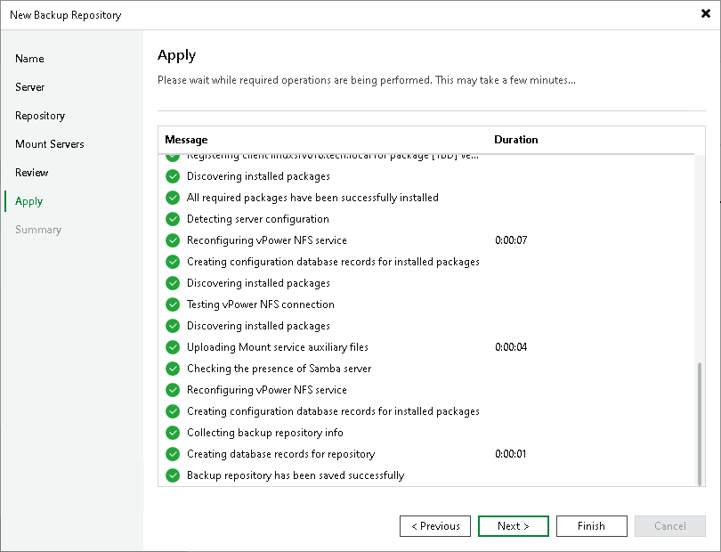

# Step 7. Apply Backup Repository Settings

In this article

At the Apply step of the wizard, wait for Veeam Backup & Replication to install and configure all required components. Then click Next to complete the procedure of adding the backup repository to the backup infrastructure.

Page updated 6/20/2025

Page content applies to build 13.0.1.1071
