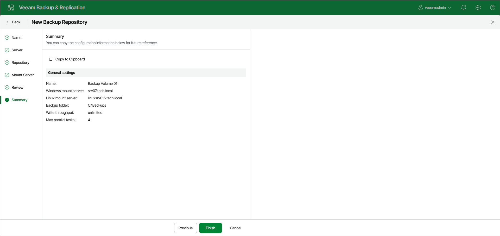

# Step 7. Finish Working with Wizard

At the Summary step of the wizard, review details of the backup repository. Then click Finish to complete the procedure of adding the backup repository to the backup infrastructure. Veeam Backup & Replication will install and configure all required components.

