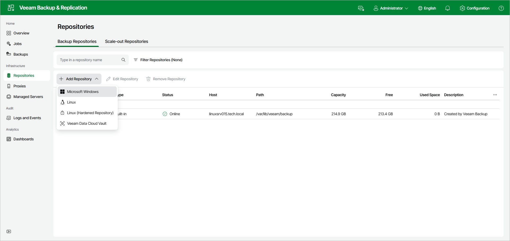

# Step 1. Launch New Backup Repository Wizard

In this article

To launch the New Backup Repository wizard, do the following:

1. Open the Repositories node in the management pane.
2. Click Add Repository on the ribbon and select Microsoft Windows.

Page updated 8/6/2025

Page content applies to build 13.0.1.1071
