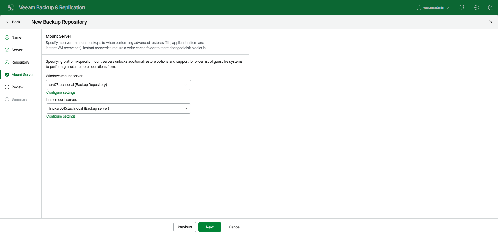
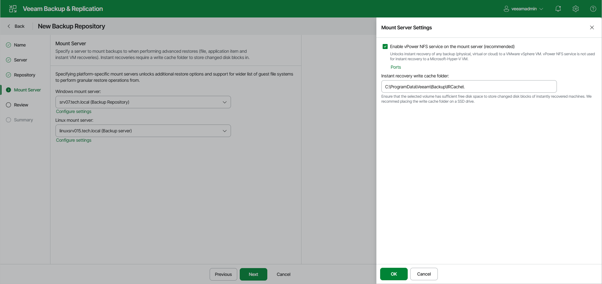

# Step 5. Specify Mount Server Settings

In this article

At the Mount Server step of the wizard, specify settings for the mount servers that you plan to use for restores that work with guest OS files and application items.

During the restore process, Veeam Backup & Replication mounts the disks from the backup file residing in the backup repository to the mount server. As a result, workload data does not have to travel over the network, which reduces the load on the network and speed up the restore process.

At least one mount server is required for file-level and application items restore. If the Windows-based mount server or the Linux-based mount server is not selected, Veeam Backup & Replication will fail over to the default mount server. For more information on mount servers and default mount server selection, see [Mount Servers](mount_server.md).

To configure the mount server settings:

1. From the Windows mount server list, select a Microsoft Windows server that you want to use as a mount server. The Windows mount server list contains only Microsoft Windows servers added to the backup infrastructure. For more information, see [Adding Microsoft Windows Servers](add_windows_server.md).
2. From the Linux mount server list, select a Linux server that you want to use as a mount server. The Linux mount server list contains only Linux servers added to the backup infrastructure and Veeam Software Appliance. For more information, see [Adding Linux Servers](add_linux_server.md).

1. Click Configure settings to open the Mount Server Settings window.
2. To make the backup repository accessible by the [Veeam vPower NFS Service](vpower_nfs_service.md), select the Enable vPower NFS service on the mount server check box. Veeam Backup & Replication will enable the vPower NFS Service on your selected mount server.

|  |
| --- |
| Important |
| Consider the following:   * vPower NFS settings are not applicable in Microsoft Hyper-V environments. * Do not enable Microsoft Windows NFS services on the machine where you install the Veeam vPower NFS Service. If Microsoft NFS services and Veeam vPower NFS Service are enabled on the same machine, both services may fail to work correctly. |

1. Click Ports to customize network ports used by the Veeam vPower NFS Service. In the vPower NFS Port Settings window, specify the following settings:

* Next to the Mount Port section, specify the port that the Veeam vPower NFS Service will use to mount the vPower NFS datastore to the ESXi host.
* Next to the vPower NFS port section, specify the port that the Veeam vPower NFS Service will use to connect to the target NFS share.

1. In the Instant recovery write cache folder field, specify a folder that will be used for writing cache during mount operations.

Page updated 9/25/2025

Page content applies to build 13.0.1.1071
