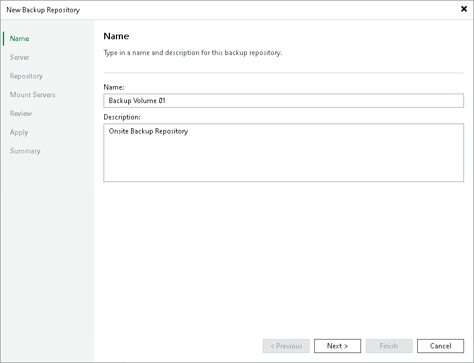

# Step 2. Specify Backup Repository Name and Description

In this article

At the Name step of the wizard, specify a name and description for the backup repository:

1. In the Name field, specify a name for the backup repository.
2. In the Description field, provide a description for future reference.

Page updated 1/25/2024

Page content applies to build 13.0.1.1071
