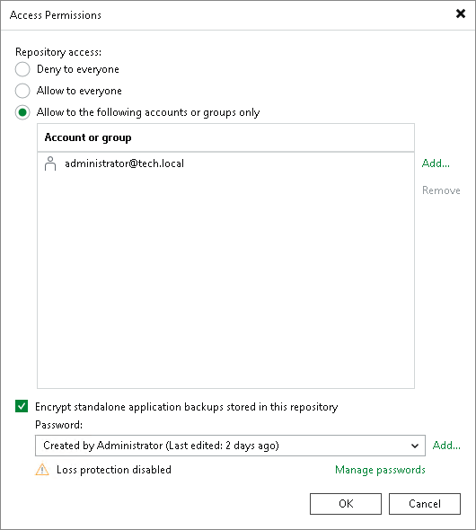

# Access and Encryption Settings on Repositories

In this article

When you configure Veeam Plug-In, you specify an account that must be used to connect to the Veeam Backup & Replication server.

Before granting access permissions, consider the following:

* Consider supported types of backup repositories and limitations for Veeam Plug-In backups in [Veeam Backup Repositories](sap_repos.md).
* To store backups in a backup repository, the specified account must have access permissions on the target backup repository.

To grant access permissions, do the following:

1. In Veeam Backup & Replication, open the Backup Infrastructure view.
2. In the inventory pane, click one of the following nodes:

* The Backup Repositories node — if you want to grant access permissions on a regular backup repository to users.
* The Scale-out Repositories node — if you want to grant access permissions on a scale-out backup repository to users.

1. In the working area, select the necessary backup repository and click Set Access Permissions on the ribbon or right-click the backup repository and select Access permissions.

1. In the Access Permissions window, on the Standalone applications tab specify to whom you want to grant access permissions on this backup repository:

+ Allow to everyone — select this option if you want to grant repository access to any user. This option is equal to granting access rights to the Everyone group in Microsoft Windows (anonymous users are excluded). For security reasons, the option is not recommended for production environments.
+ Allow to the following accounts or groups only — select this option if you want only specific users to be able to store backups in this repository. Click Add to add the necessary users and groups to the list.

|  |
| --- |
| Tip |
| If you want to back up data to Veeam Backup & Replication on Linux with a local Veeam appliance user, specify a user with the Service Account role. This role allows access to the Veeam backup repository and does not require the password rotation.  To learn more about available local user roles, see [Managing Users and Roles](hmc_users.md). |

1. If you want to encrypt backup files created with Veeam Plug-Ins and stored in the backup repository, select the Encrypt standalone application backups stored in this repository check box and choose the necessary password from the field below. If you have not specified a password beforehand, click Add on the right or the Manage passwords link to add a new password. Veeam Backup & Replication will encrypt files at the backup repository side using its built-in encryption mechanism. For more information, see [Encrypting Standalone Application Backups in Backup Repositories](encrypting_backups.md).

If the backup server is not connected to Veeam Backup Enterprise Manager, you will not be able to restore data from encrypted backups in case you lose the password. Veeam Backup & Replication will display a warning about it. For more information, see [Decrypting Data Without Password](decrypt_without_pass.md).

You can select a Key Management System (KMS) server in the Password field. To do this, the KMS server must be added to Veeam Backup & Replication in advance. If you choose to use KMS keys for backup file encryption at this step of the wizard, Veeam Backup & Replication immediately starts communication with the KMS server to retrieve the encryption keys. To learn more, see [Key Management System Keys](kms.md).

1. Click OK.

Page updated 5/3/2024

Page content applies to build 13.0.1.1071
