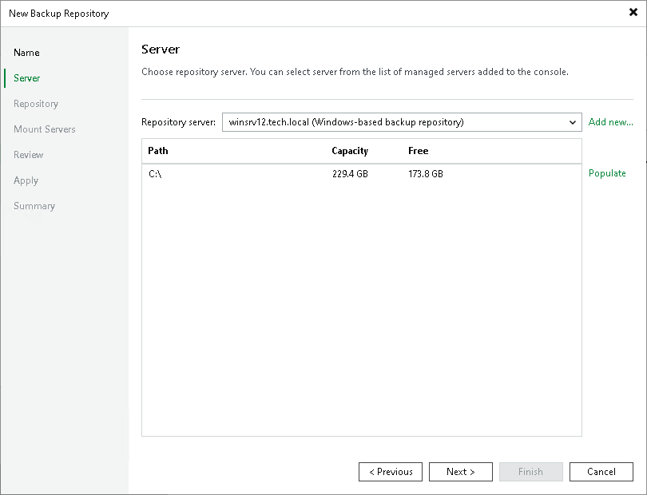

# Step 3. Specify Server or Shared Folder Settings

To configure settings for a Microsoft Windows server:

1. From the Repository server list, select a Microsoft Windows server that you want to use as a backup repository. The Repository server list contains only those servers that are added to the backup infrastructure. If the server is not added to the backup infrastructure yet, you can click Add new on the right to open the New Windows Server wizard.
2. Click Populate to see a list of disks connected to the server, their capacity and free space.

