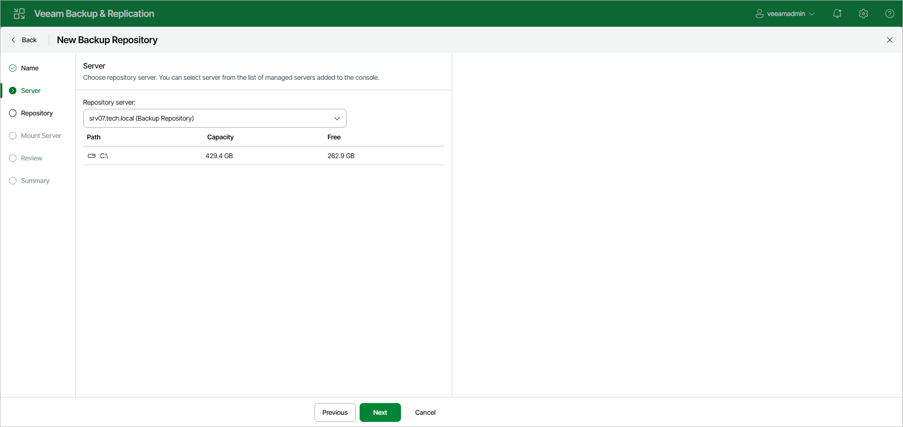

# Step 3. Specify Server or Shared Folder Settings

In this article

At the Server step of the wizard, select a Microsoft Windows server that you want to use as a backup repository from the Repository server list. The Repository server list contains only those servers that are added to the backup infrastructure. For more information on how to add Microsoft Windows servers, see [Adding Microsoft Windows Servers](add_windows_server.md).

Once the repository server is selected, you can see a list of disks connected to the server, their capacity and free space.

Page updated 6/20/2025

Page content applies to build 13.0.1.1071
