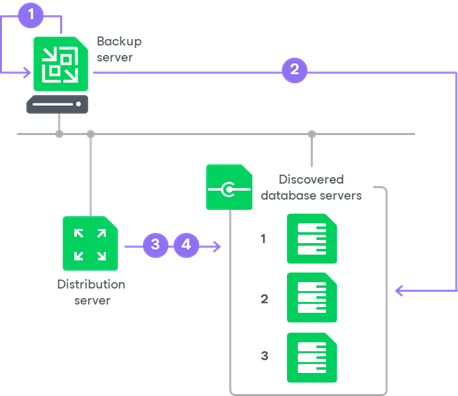

# Rescan Job

For automated discovery of protected computers, Veeam Backup & Replication uses the rescan job that runs on the backup server. Veeam Backup & Replication automatically creates this job once you create the first protection group in the inventory. The rescan job runs upon schedule defined individually for every protection group in the protection group settings. By default, Veeam Backup & Replication is set up to perform discovery at 9:00 PM daily. You can adjust daily schedule in the protection group settings or define periodic schedule.

The rescan job itself is not displayed in the Veeam Backup & Replication console. However, you can start and stop rescan job sessions manually for a specific protection group or individual computer in the inventory. This may be helpful, for example, if new computers appeared in your infrastructure, and you want to discover these computers without waiting for the next scheduled rescan job session start. To learn more, see [Rescanning Protection Group](protection_group_rescan.md) and [Rescanning Protected Computer](protected_computers_rescan.md).

You can view statistics for currently running and already performed rescan job sessions. To learn more, see [Viewing Rescan Job Statistics](report_rescan_job_stats.md).

How Rescan Job Works

When the rescan job is started, Veeam Backup & Replication performs the following operations:

1. Obtains settings specified for the protection group from the configuration database. The settings include a list of computers to scan, an account for connecting to these computers, and so on.

1. Connects to each computer in the list under the specified account:

* On Microsoft Windows computers, Veeam Backup & Replication connects to a computer using the administrative share (admin$) of the target computer. An account that you plan to use to connect to a computer included in the protection group must have access to the administrative share.
* On Linux computers, Veeam Backup & Replication connects to a computer using SSH.

Keep in mind that to connect to a Linux computer using SSH, this Linux computer must be added to the list of trusted hosts. To learn more, see [Configuring Security Settings](security_settings.md).

1. Deploys Veeam Installer Service on each newly discovered computer.

In case of Linux-based computers, this service has a different name: Veeam Deployer Service.

1. If the automatic Veeam Plug-In deployment option is enabled in the protection group settings, Veeam Backup & Replication deploys Veeam Plug-In on discovered computers. As a part of this process, Veeam Backup & Replication performs the following operations:

1. Veeam Installer Service running on the computer collects information about the computer and sends it to Veeam Backup & Replication. The collected data includes details on the computer (platform, host name, guest OS, IP address, BIOS UUID) and Veeam Plug-In (product presence on the computer and version).
2. Veeam Backup & Replication uploads the Veeam Plug-In setup files from the distribution server to the discovered computer.
3. Veeam Backup & Replication deploys the openSSL package that is required for the Veeam Plug-In functioning.
4. Veeam Installer Service deploys Veeam Transport Service and Veeam Plug-In on the target computer.

If Veeam Installer Service detects that Veeam Plug-In is already deployed on the target computer, Veeam Backup & Replication becomes the owner of this Veeam Plug-In. To learn more, see [Veeam Plug-In Ownership](ownership.md).

1. Veeam Installer Service retrieves the TLS certificate with a public key from the backup server and saves a TLS certificate with a public key in the Veeam Plug-In configuration database on the target computer. Veeam Plug-In will use this certificate to connect to Veeam Backup & Replication.
2. Veeam Transport Service and Veeam Plug-In running on the target computer collect information about databases available on the target computer. To learn more, see [Database Detection](rescan_job_db_detection.md).

Related Tasks

* [Creating Protection Groups](protection_group_create.md)
* [Rescanning Protection Group](protection_group_rescan.md)
* [Rescanning Protected Computer](protected_computers_rescan.md)
* [Viewing Rescan Job Statistics](report_rescan_job_stats.md)

