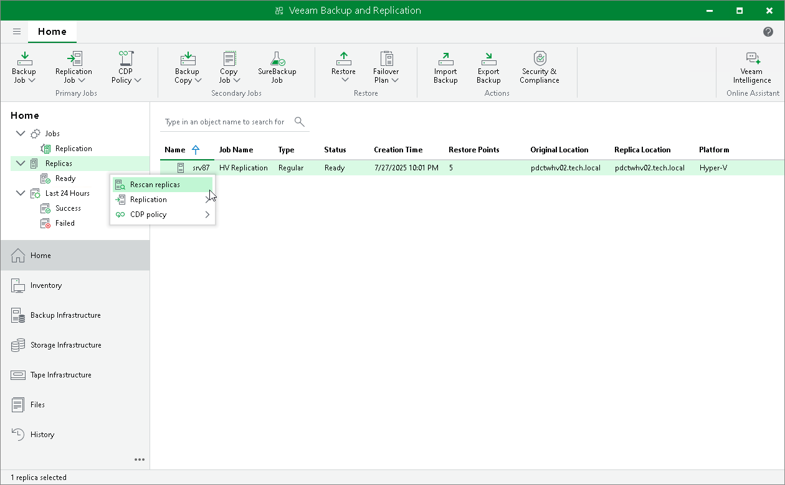

# Rescanning Replicas

In this article

You may need to perform replica rescan in the following cases:

* After you delete restore points for one or more replicas.
* After you restore the configuration database, and the session results show that some hosts used to register replicas were unavailable during the session.

To check whether any errors occurred during the database restore session, open the Home view and select System in the inventory pane. In the working area, right-click the Configuration Database Resynchronize job and select Statistics.

During the rescan process, Veeam Backup & Replication gathers information on replicas that are currently available in backup repositories and updates the list of replicas in the configuration database.

To rescan replicas, do the following:

1. Open the Home view.
2. In the inventory pane, right-click the Replicas node and select Rescan Replicas.

Related Topics

[Restoring Configuration Database](vbr_config_restore_linux.md)

Page updated 8/25/2025

Page content applies to build 13.0.1.1071
